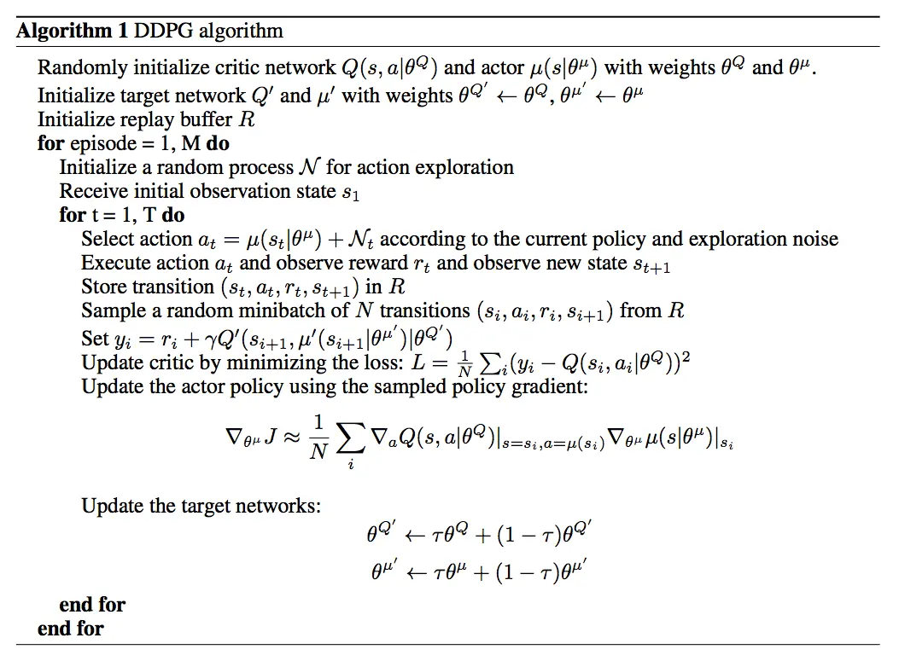
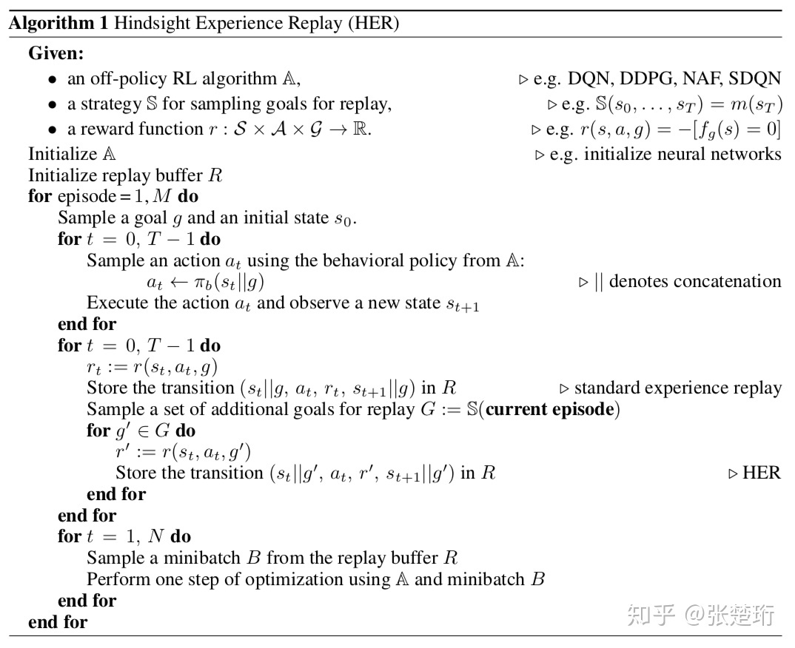
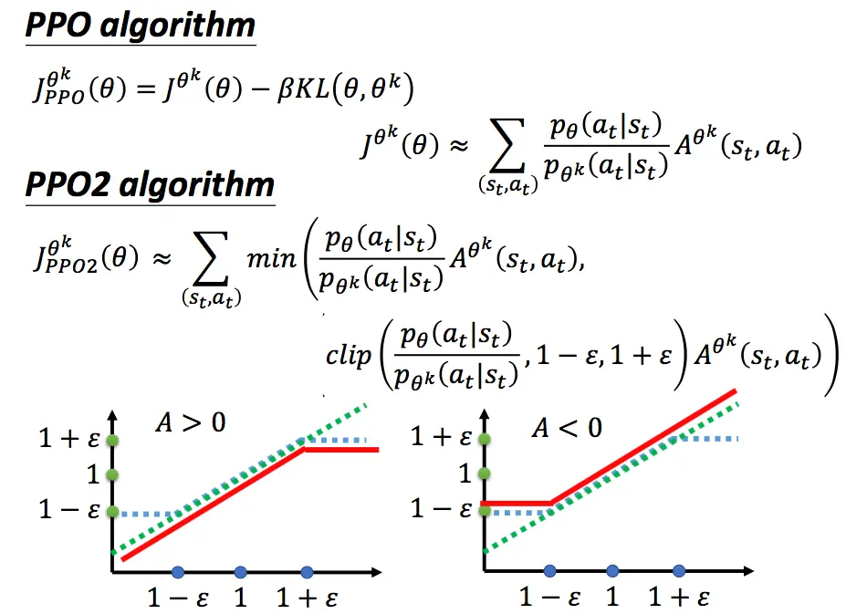

# 机器学习知识

使用正则化缓解过拟合，生成min L(w, b) + a R(w),其中L是损失函数，R是正则项。正则项使用二范数代表岭回归(ridge regression),使用一范数代表（LASSO),a是品格和那个损失函数和正则项的超参数，可以在验证集上使用[交叉验证](https://zhuanlan.zhihu.com/p/24825503)选取。

交叉熵：cross entropy 用于分类问题的损失函数，设$p和q是两个m维的向量$，交叉熵为：
$$
H(p, q) = -\sum_{j = 1}^{n}p_j \cdot ln q_j
$$
KL散度：Kullback-Leibler divergence 相对熵，衡量两个概率分布的区别有多大
$$
KL(p, q) = \sum_{j = 1}^{n}p_j \cdot ln \frac{p_j}{q_j}
$$


softmax函数:

对于k维向量$[z_1, z_2, ..., z_k]^T$,softmax函数的定义为：
$$
softmax(z) = \frac{1}{\sum_{l=1}^{k}exp(z_l)}\left[ exp(z_1), exp(z_2), ..., exp(z_k)\right]^T
$$


随机梯度下降:

目标值是实数时，梯度与变量的形状相同

离散概率分布的熵：
$$
Entory(p) = - \sum_{i=1}^{n}p_i \cdot ln p_j
$$


# 强化学习基本概念

策略（policy）

回合（episode）:游戏从开始到结束

轮次(epoch):是指所有数据进行一次正向和反向传播过程

动作的随机性来自策略，状态的随机性来自状态转移（当前状态和智能体的动作确实之后，下一个状态可能是不确定的，比如马里奥中蘑菇的移动是随机的；但对于围棋游戏而言就是确定的）

奖励由状态和动作确定，但由于状态和动作都是不确定的，导致奖励同样具有不确定性

马尔可夫性质：下一时刻的状态只依赖于当前的状态和动作，而不依赖于过去的状态和动作

轨迹：在一个回合中，智能体观测到的所有状态，奖励，动作。

奖励：智能体执行一个动作之后，环境返回智能体的数值，奖励依赖于当前状态、当前动作和下一个状态

回报：从当前时刻开始到本回合结束的所有奖励总和，折扣回报，给未来的奖励打折。回报的奖励来自对将来未知状态和动作的随机性。

当折扣率小于1时，无限MDP过程的奖励函数是有界的

价值函数是回报的期望，价值函数越大，证明对现状越有利

动作价值函数：t时刻的动作价值函数依赖于当前状态s_t.当前动作a_t,策略函数pi（决定未来的动作，进而使用状态转移方程确定未来的状态）

最优动作价值函数：排除策略的影响，在动作价值函数中选择最优策略。即已知当前时刻的状态和动作，无论未来选取什么样的策略pi,回报U都不会超过这个最大值。

状态价值函数：对动作求期望，及策略与动作价值函数乘积的求和：sum(pi(a|s) * Q_pi(s_t, a))

最优贝尔曼方程：最优动作价值函数（s_t, a_t） = 期望{当前时刻奖励R_t + 折扣因子 * 未来最优价值函数}

1. **状态值函数的贝尔曼方程**：

   贝尔曼方程用于状态值函数的情况，它描述了一个状态的值与下一个状态的值之间的关系。对于状态值函数V(s)，贝尔曼方程如下：

   V(s) = R(s) + γ * Σ[P(s' | s, a) * V(s')],

   其中：

   - V(s) 表示状态s的值。
   - R(s) 表示在状态s下采取任意动作后获得的即时奖励。
   - γ 是折扣因子，用于衡量未来奖励的重要性。
   - P(s' | s, a) 表示从状态s采取动作a后，进入状态s'的转移概率。
   - Σ 表示对所有可能的下一个状态s' 求和。

   这个方程表达了状态值函数V(s) 与下一个状态s' 的值之间的关系，考虑了即时奖励、未来奖励和状态转移的影响。

2. **动作值函数的贝尔曼方程**：

   贝尔曼方程也适用于动作值函数的情况，它描述了在特定状态下采取特定动作的值与下一个状态的值之间的关系。对于动作值函数Q(s, a)，贝尔曼方程如下：

   Q(s, a) = R(s, a) + γ * Σ[P(s' | s, a) * max(Q(s', a'))],

   其中：

   - Q(s, a) 表示在状态s下采取动作a的值。
   - R(s, a) 表示在状态s下采取动作a后获得的即时奖励。
   - γ 是折扣因子，用于衡量未来奖励的重要性。
   - P(s' | s, a) 表示从状态s采取动作a后，进入状态s'的转移概率。
   - max(Q(s', a')) 表示在下一个状态s' 中选择最大Q值的动作a'。

   这个方程表达了动作值函数Q(s, a) 与下一个状态s' 的值之间的关系，考虑了即时奖励、未来奖励、状态转移和选择最优动作的影响

行为策略：控制智能体与环境进行交互的策略，作用是收集经验

目标策略：控制智能体移动

同策略（on-policy）:行为策略与目标策略相同

异策略（off-policy）:不同，如DQN中行为策略是w-greedy策略，使得行为策略具有随机性,目标策略则是greedy策略，控制执行动作。

**同策略(On-policy)和异策略(Off-policy)的最主要区别在于它们的策略网络更新方式**

强化学习中的同/异策略(on/off policy)主要指的是策略网络的更新方式,区别在于是否仅根据当前策略采集的数据进行更新。

具体来说:

同策略方法:

- 仅根据当前策略π生成的数据来更新网络
- 如策略梯度、Actor-Critic等
- 数据高效,容易实现

异策略方法:

- 根据一定规则利用其他策略μ生成的数据来更新当前策略π
- 如Q-Learning、DDQN等
- 更稳定,但实现难度较大

主要区别:

- 同策略只用π的数据,异策略可用其他策略μ的数据
- 同策略更直接、高效,异策略更稳定

经验回放：将智能体与环境交互的记录暂时保存，然后从中采样和学习的训练方式

**策略学习中的策略网络的目标函数是动作价值函数的期望**

强化学习中，基于价值的学习（Value-Based Learning）和基于策略的学习（Policy-Based Learning）是两种不同的方法，用于学习和优化智能体在环境中的行为。它们的本质区别在于它们试图解决问题的方式以及它们的重点。

1. **基于价值的学习（Value-Based Learning）：**
   - 基于价值的学习的核心思想是通过学习和估计状态或状态-动作对的价值函数，以指导智能体的行为。价值函数表示了在不同状态下采取不同动作的长期回报或价值。
   - 基于价值的学习方法试图找到最优的策略，即使智能体如何选择动作以最大化预期回报。这通常通过找到最大化价值函数的动作来实现。
   - 常见的基于价值的学习算法包括Q学习、深度Q网络（DQN）等。
2. **基于策略的学习（Policy-Based Learning）：**
   - 基于策略的学习关注的是直接学习策略，而不是估计状态值或状态-动作对的价值。策略定义了在每个状态下选择动作的概率。
   - 基于策略的学习方法试图找到一个能够直接最大化期望回报的策略，而不需要估计状态值。
   - 常见的基于策略的学习算法包括策略梯度方法，如 REINFORCE，TRPO 和 PPO。

本质区别：

- 基于价值的学习着重于估计状态值或状态-动作对的价值，然后通过选择最大化价值的动作来确定策略。
- 基于策略的学习着重于直接学习策略，以找到最优策略，而不涉及价值函数的估计。

生成确定性策略的优点包括：

- 确定性策略更容易收敛，因为智能体可以学习针对每个状态选择最佳动作的策略。
- 确定性策略通常更容易优化，因为可以应用常见的优化算法来找到最佳策略。

然而，确定性策略可能在某些情况下不够灵活，因为它无法处理环境中的随机性。在这种情况下，使用随机策略可能更合适。

**1. 基于模型的强化学习（Model-Based RL）：**

- **环境建模：** 基于模型的强化学习方法试图建立一个对环境的内部模型，该模型能够预测在给定状态和动作下的未来状态以及奖励。这个模型通常是一个状态转移函数和奖励函数的估计。
- **策略学习：** 基于模型的方法使用内部模型来规划和学习最佳策略。这可以通过应用强化学习算法，如模型预测控制（Model Predictive Control）来实现。
- **优点：** 基于模型的方法可以更有效地探索环境，特别是在样本效率方面。它们可以使用模型来规划未来的动作，减少试错成本。
- **缺点：** 建模环境通常是复杂的，且容易受到建模误差的影响。如果模型不准确，最终的策略也可能不准确。此外，基于模型的方法通常需要更多的计算资源。

**2. 无模型的强化学习（Model-Free RL）：**

- **环境建模：** 无模型的强化学习方法不尝试建模环境的动态特性。它们直接与环境进行交互，观察状态、执行动作并获得奖励。
- **策略学习：** 无模型的方法试图直接学习策略，即在给定状态下选择动作的概率，而不依赖于模型的预测。
- **优点：** 无模型的方法通常更简单，适用于具有复杂、难以建模的环境。它们不需要依赖环境模型，因此在某些情况下更鲁棒。
- **缺点：** 无模型的方法通常需要更多的样本来学习，因为它们无法像基于模型的方法那样有效地规划未来的动作。它们可能会导致探索问题，特别是在高维状态空间或连续动作空间中。

结构化探索：


梯度截断gradient clip ：应对梯度爆炸

```python
torch.nn.utils.clip_grad_norm_(model.parameters(), max_norm=1.0)
#max_norm表示梯度的最大范数，超过这个值就进行缩放
```

标准化奖励：
$$
normalized_reward = \frac{reward - mean(reward)}{std(reward)}
$$
作用稳定训练和加速收敛

[GAE](https://zhuanlan.zhihu.com/p/139097326)（Generalized Advantage Estimation）是一种用于估计优势函数（Advantage Function）的算法，旨在更准确地估计每个时间步的优势。这对于在强化学习中进行策略优化和价值函数估计非常有用。公式如下：
$$
A_t^{\text{GAE}(\gamma, \lambda)} =  \left( \delta_t + (\gamma \lambda) \delta_{t+1} + (\gamma^2 \lambda) \delta_{t+2} + \ldots + (\gamma^{T-t-1} \lambda^{T-t-1}) \delta_{T-1} \right)
$$
其中$A_t^{\text{GAE}(\gamma, \lambda)}$是估计的优势，$\delta_t = r_t + \gamma V(s_{t+1} - V(s_t))$是时间$t$的差分。$\lambda$是衰减因子，平衡高阶与低阶估计的重要性。

SDE: state-dependent exploration,在一个回合内，给定状态 s 的动作 a 将是相同的，而不是围绕平均值振荡。

假设$\pi(s,a)$与状态$s$之间是线性关系，在选取动作时加入噪声，效果如下：
$$
a = \pi(s_t, \theta) + \epsilon(s_t, \theta_1)
$$
gSDE:

在SDE基础上，进行改进：首先不是一个回合更新$\theta_1$,而是每隔n步；而是使用特征向量(确定动作的前一层网络的输出)代替状态$s$

"Mode-collapse" 意味着策略没有足够地探索或适应环境的多样性，而是过于集中在某个模式上。"Mode-covering" 的概念强调了策略在学习过程中需要广泛地尝试和覆盖各种环境模式，而不仅仅是过度依赖于已知的、常见的状态。

**max entropy model**最大熵模型

时SAC算法出色控制性能的关键。熵：信息量的期望，描述随机量的不确定性的度量。当随机变量中每一种可能发生的情况相同时，及服从均匀分布时，熵最大。

最大熵模型的意义就是：**在满足已知知识或者限定条件下，对未知的最好推断是随机不确定性的（各随机变量等概率）**

最大熵模型：在满足限定条件下(获得足够的回报)，对未知状态空间等概率随机探索。


re-parameterization

可以通过从固定分布（例如标准正态分布）中采样噪声，并将它与策略的输出结合，从而生成采样动作。这种技巧使得梯度计算更加直接和可行，可以使用反向传播进行训练。

例如，对于高斯分布的Reparameterization Trick，如果策略输出均值（mean）和标准差（std），我们可以通过以下方式生成采样：$a=mean+std×ϵ$,其中，ϵ 是从标准正态分布中采样得到的噪声。


关于随机策略和确定性粗略，对于最优行为较为确定的1个场景而言，确定性策略能够更快的收敛到最佳策略；而对于存在多个最优或次优行为的场景，应该让智能体学习到一个较为随机的策略，使其探索到更多好行为。


"Downstream RL agent"（下游强化学习代理）是一个术语，主要用于强调在分层强化学习或迁移学习中的不同层次的智能代理。

1. **上游任务 (Upstream Task):** 这是一个代理在学习的过程中首先面对的任务。通常，这是一个比较通用的任务，可能在某个领域内有大量的样本或经验。代理通过解决上游任务来学习通用的特征或策略。

2. **下游任务 (Downstream Task):** 下游任务是在上游任务之后，代理可能要解决的具体任务。这个任务可能与上游任务有一些相似之处，但可能需要更多的细化或特定的技能。下游任务的目标是利用在上游任务中学到的通用知识，更高效地解决具体的问题。

在迁移学习中，上游任务的学习可以为代理提供一些通用的能力，然后这些能力可以通过微调或其他方式应用到下游任务中。这种分层的学习过程可以提高代理在特定任务上的效率，因为通用特征已经在上游任务中得到了学习。

在强化学习中，上游任务可能是在一些仿真环境中学到的，而下游任务可能是在真实世界环境中应用这些学到的策略。这样的分层结构可以提高算法的鲁棒性和泛化能力。

因此，"downstream RL agent" 通常指的是在层次学习或迁移学习中用于解决更具体、更应用领域问题的智能代理。

Universal Value Function Approximator (UVFA)

[UVFA,HER相关思考](https://zhuanlan.zhihu.com/p/110468145)

从定义来说，值函数量化了**某个策略积累某种报酬的能力**。从另一个角度思考，值函数量化了**一个agent完成某个任务的能力**。好，那么最优值函数 ，量化了完成某个任务的最优方式。从某种意义上讲，其量化的是**关于某个策略在某个环境下如何最优地完成某个任务的能力的知识**。

UVFA将不同的值函数糅合成一个，给MDPs增加goal空间，使用goals作为计算报酬的中间媒介，goal作为报酬函数的输入，把值函数的输入扩展为$v_{\pi}(s,g)$

importance sampling

重要性采样（Importance Sampling）是一种用于估计一个分布下期望的统计技术。这通常在蒙特卡洛积分或蒙特卡洛模拟中使用，特别是当我们希望估计一个分布的期望，但无法直接从该分布中采样时。

考虑一个期望形式的积分：
$$
[E[f(X)] = \int f(x) p(x) , dx]
$$
其中 $f(x)$ 是我们希望对其进行期望的函数，\(p(x)\) 是 \(X\) 的概率分布。如果我们不能直接从 \(p(x)\) 中采样，我们可以选择一个可以采样的分布 \(q(x)\) 来替代，然后使用重要性采样来估计这个期望。

重要性采样的基本思想是，我们可以通过从 \(q(x)\) 中抽取样本，然后使用一个权重来修正这些样本，以便更好地反映我们感兴趣的分布 \(p(x)\)。这个权重通常是$ p(x)/q(x)$。

期望的重要性采样估计为：
$$
\hat{E}[f(X)] = \frac{1}{N} \sum_{i=1}^{N} \frac{f(X_i) p(X_i)}{q(X_i)}
$$
其中 \(X_i\) 是从 \(q(x)\) 中采样得到的样本。

这个估计是无偏的，但方差可能很大，尤其是当 \(q(x)\) 与 \(p(x)\) 差异较大时。一般来说，重要性采样在 \(q(x)\) 不太离谱时效果最好。

需要注意的是，为了确保重要性采样有效，我们通常需要选择一个 \(q(x)\)，使得 \(q(x) \neq 0\) 当且仅当 \(p(x) \neq 0\)。这是为了避免分母为零的情况，从而导致权重无法定义。

# 价值学习

## DQN

首先使用卷积神经网络将状态转换为特征向量，之后使用一个全连接神经网络学习最优动作价值函数，输出每一个动作的评分。

训练DQN常见的方法时TD(时间差分)算法，又称为Q学习，结合动态规划和蒙特卡洛方法的特点，在未来奖励的估计和已有的估计之间进行更新的迭代算法

训练过程：


收集训练数据：使用任意策略控制智能体于环境进行交互则pi成为行为策略，常见行为策略时w-greedy策略，之后将一个回合产生的轨迹分成相应的四元组，存入缓存，这个缓存称之为经验回放缓存

更新参数：

Q学习得到最优动作价值函数:

假设状态空间S和动作空间A都是有限集合，可以将最优动作价值函数表示为一个表格，根据这个表格选择每一个状态下可以执行的最优的动作。

目标策略是贪婪策略，选择每个状态下具有最高Q指的动作；行为策略是ε-贪心策略，具有随机性

他们对这个误差项进行了剪切，使其范围在-1和1之间。这种剪切操作相当于采用了绝对值损失函数 $|x|$，对于超出(-1, 1)区间的误差，其导数（梯度）会被限制在-1和1之间。


## SARSA算法

state-action-reward-state-action的缩写，使用的是五元组，其中最后一个action是由策略pi抽样得到，是假想的动作，智能体不予执行所以，该算法学习到的q依赖于策略pi

目标是学习动作价值函数，是一种同策略，表格法使用离散状态和动作，神经网络的形式适用于离散动作和连续状态

**表格法训练过程：**

观测当前状态，根据策略得到a

更新表格

执行动作后得到状态s_t+1和奖励r_t

根据当前策略抽样得到a_t+1

更新表格中(s_t+1, a_t+1)

计算TD目标和TD误差

更新表格中（s_t, a_t）

更新策略（不属于sarsa算法）

**神经网络形式**

使用神经网络近似动作价值函数，称为价值网络。训练过程与表格法相同

传统的动作价值函数作为确定性策略控制智能体，但是现在动作价值函数通常用于评价策略的好坏

**多步TD目标**：在上述的基础上，是智能体按照一定的策略pi与环境交互m步

训练过程中可以使用策略控制智能体与环境交互一个回合，生成一段轨迹，对每一步进行多步TD预测

**蒙特卡洛法**：使用价值网络学习一个回合的真实回报，好处是无偏性，坏处是方差大，收敛慢

**自举bootstrapping**:使用一个估算更新同类的估算，如TD中使用价值网络自身做出的估算更新价值网络自身。好处是方差小，坏处是有偏差，偏差会从q(s_t+1, a_t+1)传到q(s_t, a_t),收敛快。

多步TD算法则是介于蒙特卡洛与自举两种方法之间，使得方差和偏差之间得到较好的平衡

## 价值学习的技巧

**1.经验回放**

当经验回放缓存中四元组数量不够时，DQN只与环境交互，不去更新，不然效果不好

样本数量与更新次数

优点：打破相关性，可以在缓存中随机抽样进行更新网络

优先经验回放：优先经验回放会给每一个四元组一个权重，根据权重进行非均匀随机抽样，若DQN对（s_j, a_j）判断不准，则四元组(s_j, a_j, r_j, s_j+1)具有较高的权重。实现中，如果TD误差较大，则对应的四元组应该有更高的权重。一种抽样方式是p ∝TD_error + w(极小值，防止抽样为0)或 p  ∝ 1 / rank(j)(TD_ERROR从大到小的排序结果)

[知乎：优先经验回放讲解](https://zhuanlan.zhihu.com/p/337171931)

```python
```


贪婪的根据TD误差大小确定，存在问题：最初的错误的会频繁重播，导致过拟合

**不同的样本有不同的抽样概率，会导致DQN的预测有偏差，应该相应的调整学习率，抵消不同抽样概率造成的偏差**

学习率$a_j = a / ( b * p_j ) ^d$，其中d应该从较小值增加到1，b是缓存大小

**2.高估问题及解决方案**

高估问题原因：自举导致的 偏差传播，最大化导致TD目标高估真实价值

高估产生的危害，主要原因是高估是不均匀的，非常可能导致某一个较差的动作产生max的价值，导致较差的策略

解决方法：

切断自举：加上一个目标网络，用来计算TD目标，目标网络与DQN网络结构相同,目标网络进行s_j+1时刻的评估

缓解高估：在目标网络基础上改进，形成双Q学习

将TD目标生成时评估s_j+1时刻的最大价值时，分为两步，第一步是选择最大的动作（max）,第二部是根据该动作确定价值。原始Q学习，选择和求值都使用DQN，使用目标网络的Q学习都使用目标网络，双Q学习中选择使用DQN，求值使用目标网络

**3.对决网络dueling network**

是对DQN的神经网络结构进行的修改

将最优动作价值函数分成最优状态价值和最优优势

最优状态价值

最优优势函数 = 最优动作价值函数 -  最优状态价值函数 ===》最优动作价值函数Q* = 最优状态价值函数V* + 最优优势函数D* - maxD*(恒为0)，其中增加maxD的原因是解决唯一性，如果没有，V与D中参数可以随意变换，单数不影响输出。实际中不使用max ，而是使用 mean。优化并不那么稳定，因为优势必须补偿优化行为优势的任何变化。由于这个原因，本文提出了一种用平均值代替最大算子的替代模型:

对决网络由两个网络组成，一个估计最优优势函数（输出与动作空间结构相同），一个估计最优状态价值函数（产生实数）

对梯度进行剪裁

**4.噪声网络 noisy net**

将网络中参数w = u(均值) + a(标准差) * b(随机噪声)

当使用噪声网络时，具有随机性，可以不再使用w-greedy方法作为行为策略

加入噪声后，迫使DQN容忍对参数的扰动


# 策略学习

通过求解优化问题，学出最优策略函数。对于具有离散动作的游戏而言，网络的输入s可能是一张照片，输出层的激活函数是softmax,输出向量全正，相加为1，对应每一个动作的概率值。

## 策略梯度定理

策略的目标函数$J(\theta) = E_s[V_{\pi}(S)]$,排除状态S的因素，只依赖于策略网络pi的参数$\theta$

考虑一个马尔可夫决策过程（Markov Decision Process, MDP），其中有一个策略 $\pi$（参数化策略函数），表示在状态 $s$ 下采取行动 $a$ 的概率，即 $\pi(a|s) = P(a|s)$。需要满足假设==状态$S$服从马尔科夫链的稳态分布==

策略梯度定理描述了如何最大化期望回报 $J(\pi)$，其中 $J(\pi)$ 表示在策略 $\pi$ 下的期望回报，定义为：

$$
\begin{equation}
J(\pi) = \mathbb{E} \left[ \sum_{t=0}^{\infty} \gamma^t R_t \right]
\end{equation}
$$
其中，$$R_t$$ 是在时间步 $t$ 获得的奖励，$\gamma$ 是折扣因子，$\mathbb{E}$ 表示期望。

策略梯度定理表述如下：

$$
\begin{equation}
\nabla J(\pi) \propto \mathbb{E} \left[ \sum_{t=0}^{\infty} \nabla \pi(a_t|s_t) \cdot Q^{\pi}(s_t, a_t) \right]
\end{equation}
$$


其中，$\nabla J(\pi)$ 表示 $J(\pi)$ 相对于策略参数的梯度，$\nabla \pi(a_t|s_t)$ 表示策略相对于参数的梯度，$Q^{\pi}(s_t, a_t)$ 是状态-行动对 $(s_t, a_t)$ 的状态值函数。

要最大化期望回报 $J(\pi)$，可以使用梯度上升法，通过不断更新策略参数来使梯度 $\nabla J(\pi)$ 升高。

**近似策略梯度**

每次从环境中观测到一个状态$s$,然后根据当前策略网络随机抽样一个动作，计算随机梯度$g(s,a;\theta)$，$g(s,a;\theta)$是$\nabla J(\pi)$的无偏估计
$$
\begin{equation}
\nabla J(\pi) = \mathbb{E} \left[ \sum_{t=0}^{\infty} \nabla \pi(a_t|s_t) \cdot A_t \right] = g(s,a;\theta) = Q_\pi(s,a) \cdot \nabla ln\pi(a | s; \theta)
\end{equation}
$$
梯度上升的公式为：
$$
\begin{equation}
\theta \gets \theta + \beta \cdot g(s,a;\theta) 
\end{equation}
$$


同时需要对$Q_\pi(s,a)$进行近似

**REINFORCE & actor-critic**

REINFORCE使用实际观测的$u$近似$Q_\pi(s,a)$,使得：
$$
\tilde{g}(s,a;\theta) = u_t \cdot \nabla ln\pi(a | s; \theta)
$$
属于同策略，行为策略和目标策略都是$pi(a | s ; \theta_{now})$,其中$\theta_{now}$表示策略网络当前的参数.

actor-critic使用神经网络近似动作价值函数$Q_{\pi}(s,a)$,网络的输入是状态s，输出是每个动作对应的价值。策略网络$\pi(a|s;\theta)$,相当于演员，基于状态s做出动作a,价值网络$q(s,a;\omega)$相当于评委，给演员的表现打分。使得
$$
\tilde{g}(s,a;\theta) = q(s,a;\omega) \cdot \nabla ln\pi(a | s; \theta)
$$
需要分别训练策略网络（梯度上升）和价值网络（SARSA算法），同时可以使用目标网络改进价值网络产生的自举问题，使用目标网络评估$(s_{t+1}, \tilde{a}_{t+1})$,其中$\tilde{a}_{t+1}$由策略网络产生。

arctor-critic的训练流程：

## 带基线的策略梯度方法

带基线的策略梯度定理：设$b$是任意函数，但$b$不能依赖于动作$A$,把$b$作为动作价值函数$Q_{\pi}(S,A)$的基线，对策略梯度没有影响：
$$
\begin{equation}
\nabla J(\pi) = \mathbb{E}_{S} \left[ \mathbb{E}_{A~\pi(\cdot|S;\theta)}\left[ \left(Q_\pi(s,a)-b\right) \cdot \nabla ln\pi(a | s; \theta)\right] \right] 
\end{equation}
$$
公式成立的原因是：
$$
\begin{equation}
 \mathbb{E}_{S} \left[ \mathbb{E}_{A~\pi(\cdot|S;\theta)}\left[b \cdot \nabla ln\pi(a | s; \theta)\right] \right] = 0 
\end{equation}
$$
值得注意的是，无论$b$取什么值，随机梯度$g_b(s,a;\theta)$都是$\nabla_{\theta} J(\theta)$的无偏估计，及偏差为0，但方差有影响，若b接近$Q_{\pi}(S,A)$的均值，方差会比较小，因此$V_{\pi}(s)$是较好的基线

**带基线的REINFORCE & actor-critic**

带基线的REINFORCE使用一个神经网络$v(s;\omega)$来近似状态价值函数：
$$
\tilde{g}(s,a;\theta) = \left(u_t - v(s;\omega) \right)\cdot \nabla ln\pi(a | s; \theta)
$$
价值网络生成当前状态的价值，值得注意的是价值网络没有起到"评委"的作用，只是作为基线，目的是减少方差，加速收敛，真正帮助策略网络改进的是实际观测到的回报。训练价值网络的方法是回归，使用回合中采集的回报进行拟合，使用梯度下降拟合。策略网络还是梯度上升。

advantage actor-critic:策略梯度的无偏估计
$$
g(s,a;\theta) = \left[Q_{\pi}(s,a) - V_{\pi}(s) \right]\cdot \nabla ln\pi(a | s; \theta)
$$
其中$Q_{\pi}(s,a) - V_{\pi}(s)$称为优势函数，及advantage actor-critic（A2C），其中$v(s;\omega)$相当于评委。需要注意的是
$$
Q_{\pi}(s_t,a_t) - V_{\pi}(s_t) =\mathbb{E}_{S_{t+1}}\left[ R_t + \lambda \cdot V_{\pi}(S_{t+1}) - V_{\pi}(S_{t})\right]
$$
则无偏估计为：
$$
g(s,a;\theta) = \left[r_t + \lambda V_{\pi}(S_{t+1}) - V_{\pi}(s) \right]\cdot \nabla ln\pi(a | s; \theta)
$$
**ps:**$v(s;\omega)$只和状态有关，为什么可以评价策略网络的动作？

答：由于使用$v(s_t;\omega)$在t时刻预测回报，未执行动作$a_t$,TD目标则是在$t+1$时刻，根据回报计算得到，如果TD目标>$v(s_t;\omega)$,证明$a_t$动作较好，使得奖励超出预期，反之则动作较差，可以间接的反应动作的好坏。

A2C训练流程：

其中训练策略和价值网络的方法属于同策略，行为策略和目标策略相同，都是使用的最新的策略网络，不能使用经验回放，由于回访缓存中的数据是使用的旧的策略网络产生。同时可以使用目标网络改进自举情况。

## 策略学习的高级技巧

**1.置信域策略优化**：trust region policy optimization

与策略梯度相比，TRPO表现更稳定，收敛曲线不会剧烈波动，对学习率不敏感，且使用更少的经验就能达到与策略梯度相同的效果。

置信域：对于一个函数$L(\theta|\theta_{now})$很接近$J(\theta)$,在$\theta_{now}$的邻域内，则$\theta_{now}$的邻域可以视为置信域。不断进行**近似化**和**最大化**

如策略学习的目标函数未$J(\theta) = \mathbb{E}_S(V_{\pi}(S))$.可以将上式近似为：
$$
L(\theta|\theta_{now}) = \mathbb{E}_{a\sim\pi(\cdot|s,\theta_{now})}\left[ \frac{\pi(A|s;\theta)} { \pi(A|s;\theta_{now})} \cdot Q_{\pi}(s,a)\right]
$$

$$
L(\theta|\theta_{now}) \approx \frac{1}{n} \sum_{i = 1}^{n} \frac{\pi(A|s;\theta)} { \pi(A|s;\theta_{now})} \cdot u_t
$$

最大化则是求解一个带有约束的最大化问题。


训练流程：


**2.策略学习中的熵正则**

希望策略网络输出的概率分布的熵不要太小，要鼓励探索，可以把熵当作正则项加入策略学习的目标函数中

增大决策的不确定性十分有风险，很差的动作也可能有非零的概率，可以使用"Tsallis Entropy"做正则，让离散概率具有稀疏性，每次决策只给少部分动作非零的概率，”过滤掉“很差的动作。[43-45]

## 连续控制

**深度确定性策略梯度**（deep deterministic policy gradient. DDPG）

DDPG属于一种actor-critic方法，策略网络控制智能体的运动，价值网络基于状态$s$和动作$a$进行打分，指导策略网络进行打分。策略网络输出一个$d$维的向量，不再是输出一个对应动作的概率值，是一个确定性的值。确定性策略可以视为随机策略在均值$u$下，协方差分布全为0。

**在训练过程中，价值网络帮助训练策略网络，训练结束后价值网络被丢弃**

训练策略网络：

目标函数$J(\theta) = E_S[q(S, \mu(S:\theta), \omega)]$,策略网络的目标就是最大化这个目标函数，使用梯度上升

确定性策略梯度DPG：
$$
g_j =\nabla_{\theta}q(s_j, \mu(s_j; \theta); \omega)
$$
DPG使用链式法则求解，固定参数$\omega$,使用梯度上升更新参数$\theta$.

训练价值网络的方法与TD算法相同。

训练流程：

在经验回放缓存中抽取一个四元组

使用当前的策略网络预测$s_j$与状态$s_{j+1}$下的动作

使用当前价值网络做预测，预测$(s_j, a_j)$下和$(s_{j+1},\tilde{a}_{j+1})$下的回报

计算TD目标和TD误差

更新价值网络：**使用四元组中的动作a**

更新策略网络:**求导过程中，在链式法则中，计算q相对于动作a的梯度是，固定动作a维第一步策略产生的动作，而不是四元组中的动作**

DDPG中的价值网络学习的是动作价值函数，但随着策略网络趋近于最优，价值网络也趋近于最优动作价值函数

**双延迟深度确定性策略梯度**TD3

使用目标网络：增加目标策略网络和目标价值网络用于计算TD目标，及下一个状态下的动作$\tilde{a}_{j+1}$和$(s_{j+1}, \tilde{a}_{j+1})$下的价值

截断双Q学习：使用两个价值函数和一个策略函数，并分别对应三个目标网络，使用目标网络计算动作，两个价值网络评估价值，取较小值

其他改进：在目标网络产生的动作里加入噪声，噪声为截断正态分布，防止噪声过大；降低策略网络的更新频率，每一轮更新价值网络，每k轮更新策略网络和三个目标网络。

**随机高斯策略**

使用两个神经网络分别计算动作的均值和方差，最后的动作在这个正态分布中随机采样。

将两个网络视为一个辅助网络，使用REINFORCE和actor-critic两种方法估计动作价值函数

## 对状态的不完全观测

将时刻$0-t$内的所有观测$o_{1:t}$代替状态$s_t$,使得策略网络成为$\pi (a_t|o_{1:t};\theta)$,对于$o_{1:t}$使用循环神经网络(或者LSTM等)提取出一个固定长度的特征

## 模仿学习

imitation learnning:向人类专家学习，reinforcement learning利用环境反馈的奖励改进策略。

**行为克隆BC**

需要事先准备好包含多个(s,a)的数据集，可以视为一种监督学习，学出一个随机策略网络或者确定策略网络

连续控制问题可以视为一个确定性策略，视为回归问题，离散控制问题则视为多分类问题（交叉熵作为损失函数）

一般使用行为克隆进行初始化，之后进行强化学习改进。

**逆向强化学习**inverse reinforcement learning

基本假设：

IRL假设智能体能和环境进行交互，环境根据智能体动作更新状态，但不会给出奖励；

IRL假设可以把人类专家的策略视为黑箱调用，假设可以从人类策略中得到奖励函数

基本思想：

IRL首先从专家的策略中学习其中隐含的奖励函数网络，然后利用奖励函数进行强化学习，得到策略网络

**生成判别模仿学习**generative adversarial imitation learning GAIL

训练一个策略网络使得判别器无法分辨是策略网络的决策还是人类专家的决策


# 强化学习应用

## AlphaGo与蒙特卡洛树搜索MCTS

ahphago使用17×19×19表示一个状态，其中8个表示最近8步黑子的状态，8个代表白子的状态，一个表示应该那一方执子。策略网络输出一个361维动作向量，一个价值函数是对状态价值函数的近似。

alpha进行对战时，使用MCTS做决策，策略网络和价值网络作为辅助。

MCTS的基本原理就是向前看，模拟未来可能发生的情况，从而找到最优的动作,每次选出一个动作并执行，直到整局游戏结束，使用胜负评判动作的好坏.

基本步骤:

选择：

扩展：


# RL_baseline

## A2C


## SAC

[SAC讲解](https://zhuanlan.zhihu.com/p/444441890)

[白话讲解](https://zhuanlan.zhihu.com/p/566722896)

soft actor-critic算法，整合了 actor-critic、off-policy、maximum entory model三大框架。

在SAC中，目标函数包含了回报和策略熵，要求策略$\pi$不仅最大限度的提高最终回报，而且要求最大化熵。
$$
J(\pi) = \sum_{t=0}^{T}E_{(s_t,a_t)\sim p_{\pi}}[r(s_t, a_t) + \alpha H(\pi(\cdot|s_t))]
$$
SAC通过最大熵鼓励策略探索，为具有相近的Q值的动作分配近乎均等的概率，不会给动作范围内任何一个动作分配非常高的概率，避免反复选择同一个动作而陷入次优。同时通过最大化奖赏，放弃明显没有前途的策略（放弃低奖赏策略）。总的来说最大熵的好处就是：

1. 在最大化奖赏的同时，鼓励探索（我们的最大熵目标可以让动作更均匀的分布，因为当policy输出的动作为等概率时，熵最大）
2. 可以学到更多近优策略，提高了算法的鲁棒性
3. 训练速度加快（最大熵使探索更加均匀）

lemma1:soft policy evaluation,Consider the soft Bellman backup operator $\Gamma^{\pi}$ in equation 2 and a mapping $Q^0 : S \times A \to R$ with $|A| < \infty$, and define $Q^{k+1} = \Gamma^{\pi}Q^l$. Then the sequence $Q^k$ will converge to the soft Q value of $\pi$ as k $\to \infty$.

在策略改进中，有$\pi_{new}(a_t|s_t) \propto exp(Q^{\pi_{odd}}(s_t, a_t))$,与off-policy中最大化Q值不同， SAC中策略是更新向正比于Q的指数分布。策略分布更新为Q函数的softmax分布（多峰），而不是向往常一样的高斯分布(单峰)。但在实际操作中，还是将策略输出为高斯分布，通过最小化KL散度最小化两个分布的 差距。

并且可以证明**最小化策略分布与Q函数指数分布的KL散度，与最大化我们的目标函数是等价的**

软策略迭代：


上述方案保证了策略在有限状态动作空间内是有限的，对于高维、连续状态动作空间使用神经网络近似SAC最优策略。

软值函数$V_{\psi}(s_t)$, 软Q值函数$Q_{\theta}(s_t, a_t)$及策略函数$\pi_{\phi}(a_t | s_t)$。其中策略函数输出动作的高斯分布与方差。并在SAC中隐式定义了一个软Q值函数的target网络$\hat{Q}(s_t, a_t)$,使用$V_{\hat\psi}(s_t)$网络实现。

值函数$V_{\psi}(s_t)$使用MSE最小化残差，$Q_{\theta}(s_t, a_t)$使用MSE最小化软贝尔曼残差

训练过程：


第二版论文中：使用双Q网络减少Q值的过度估计；去除了V网络，简化训练，目标函数中正则项的参数$\alpha$是一个自适应调整的过程。

## DDPG

deep deterministic policy gradient，deterministic : actor输出具体的动作

DPG公式：
$$
\begin{equation}
\nabla J(\pi) = \mathbb{E}_{s \sim \rho, a \sim \pi} \left[ Q_\pi(s,a) \cdot \nabla ln\pi(a | s; \theta) \right]
\end{equation}
$$


使用与DQN相同的双网结构，每一个actor 与 cirtic都有 target-net与 eval-net两个。（目标网络是缓慢复制得到的）。使用下面的式子进行价值函数的估计
$$
\nabla_{\theta^{\mu}}J \approx E_{s_t \sim \rho^{\beta}}\left[ \nabla_{\theta^{\mu}}Q(s,a|\theta^Q)|_{s=s,a = \mu(s|\theta^{\mu})}  \right] = E_{s_t \sim \rho^{\beta}}\left[ \nabla_{a}Q(s,a|\theta^Q)|_{s=s,a = \mu(s_t)} \nabla_{\theta^{\mu}}\mu(s|\theta^{\mu})|_{s=s_t} \right]
$$
假如对同一个状态，我们输出了两个不同的动作a1和a2，从状态估计网络得到了两个反馈的Q值，分别是Q1和Q2，假设Q1>Q2,即采取动作1可以得到更多的奖励，那么Policy gradient的思想是什么呢，就是增加a1的概率，降低a2的概率，也就是说，Actor想要尽可能的得到更大的Q值。所以我们的Actor的损失可以简单的理解为得到的反馈Q值越大损失越小，得到的反馈Q值越小损失越大，因此只要对状态估计网络返回的Q值取个负号就好啦。

N代表样本数量，使用多个样本可以降低梯度估计的方差，同时可以提高计算效率



**问题：**没懂actor的网络如何更新？

## TD3

[白话讲解](https://zhuanlan.zhihu.com/p/409536699)

twin delay DDPG:同样是一种确定性策略强化学习算法，适合高维连续动作空间。

在DDPG的基础熵增加三个trick:

1. Clipped Double-Q Learning：跟Double DQN 解决Q值过估计的做法一样，学习两个Q-functions而不是一个（这也是名字里"twin"的由来），并使用两个Q值中较小的一个来做Bellman损失函数中的target；
2. “Delayed” Policy Updates：TD3的策略以及target networks的更新频率低于Q-functions，由于一次策略更新会改变target，延缓更新有助于缓解DDPG中通常出现的波动性。**建议每两个Q-func更新进行一次策略更新**；
3. Target Policy Smoothing：TD3会给target action增加噪声，从而通过沿动作变化平滑Q来使策略更难利用Q-func的error。

其中Target Policy Smoothing：

在 TD3 中，Target Policy Smoothing 主要用于减小 actor 网络的输出，以使得 critic 网络对动作的变化更加鲁棒。具体来说，对于选定的动作 \(a\)，Target Policy Smoothing 在其周围加入一个均匀噪声，然后再输入到 critic 网络中进行估值。

具体步骤：

1. **选择动作：** 对于 actor 网络选择的动作 \(a\)，进行以下操作。

2. **添加均匀噪声：** 在动作空间中，为 \(a\) 添加一个均匀噪声，即从 \([-c, c]\) 的均匀分布中采样一个噪声 \(b\)，其中 \(c\) 是一个预先定义的常数。

3. **裁剪：** 裁剪添加噪声后的动作 \(a_{\text{smooth}} = \text{clip}(a + b, \text{low}, \text{high})\)，确保它在有效的动作范围内。

4. **Critic 网络估值：** 将裁剪后的动作 \(a_{\text{smooth}}\) 输入到 critic 网络中，得到对应的 Q 值。

5. **目标计算：** 在更新 actor 网络时，将上述计算的 Q 值作为目标值，通过最小化 actor 网络的输出和这个目标值的误差来更新 actor 网络。

目的

Target Policy Smoothing 的目的是增加 actor 输出的鲁棒性，使得对于 critic 网络来说，即使 actor 输出有一些小的波动，对应的 Q 值也不会有太大的变化，从而提高算法的稳定性。


相关改进：

[SD3](https://zhuanlan.zhihu.com/p/343478932):加入softmax操作

[TD3 + BC](https://zhuanlan.zhihu.com/p/495616028)

问题：

在stable_baseline3中的actor-target与critic-target共享特征提取层，而不是与actor

对于critic_batch_norm_stats没看懂

## HER

[hindsight experience replay](https://zhuanlan.zhihu.com/p/138915075)后见经验回放: 可以从稀疏和二值奖励中高效采样学习，避免了复杂的奖励工程需要。在一些任务中(尤其是机器人技术)存在一个很常见的问题--稀疏奖励的问题。此时就需要设计一个更完备的奖励函数，它不仅需要反映当前的任务目标，而且需要精心设计来指导策略的优化过程。这种奖励函数的设计既需要有相关任务的领域知识，还需要强化相关的知识。

我们将只针对任务目标而构建的奖励称为unshaped reward，而将修改后能够知道策略优化的奖励称为shaped reward。

基本思想：从一个不期望的结果中吸取经验。如踢足球射门时，球向右偏，下一次将会向左调整。而不是不利用这个结果。在off-policy算法中，使用agent与环境交互，采集样本，在任意一个轮次中会采集样本$s_1, s_2,..., s_T$,并以格式$(s_t, a_t, r_t, s_{t+1})$存储到replay buffer内。此时这条轨迹是基于目标g的，但这条轨迹可以选定其他目标$g' \in G$进行回放。则回放缓存中$(s_t || g, a_t, r_t, s_{t+1} || g)$变为$(s_t || g', a_t, r_t, s_{t+1} || g')$,‖表示状态和目标的concat的拼接操作。而且行动策略(bahavior olicy)也是与目标相关的，输入是当前状态和需要完成的目标。其中G是目标集合的一个子集。

目标子集G的选取方式：

strategy final: 每次只选择这一条轨迹的最后一个状态对应的目标最为新目标，$S(s_1, ..., s_T) = m(s_T)$;这种情况下只选择一个新目标，加上原目标产生的transition，即经验池里面存放2倍于真实采样到的样本;

future — 每次随机随机选择 k个在这个轨迹上并且在这个transition之后的状态作为新目标，即如果现在的样本为 $(s_t, a_t, s_{t+1})$，那么会在$(s_{t+1}, ..., s_{T})$之间选择k个状态对应的目标作为新目标；这种情况下经验池里面存放的样本数目是真实采样到样本数目的k+1 倍(下同);



扩展：

使用GAN生成goal

## PPO

proximal Policy Optimization [近端策略优化](https://www.jianshu.com/p/9f113adc0c50)

[讲的很好，适合多看](https://zhuanlan.zhihu.com/p/614115887)

由于基于策略梯度的方法是on-policy的，参数更新较慢。PPO扩展了PG方法，使用重采样(importance sampling)技术，使得PPO变成一个**局部off-policy**的策略。由于importance weight$p(x)/q(x)$中两者差距没有那么大。

扩展到策略就是$\pi(\theta)$与$\pi(\theta')$相差不能太大，即输入同样的state，网络得到的动作的概率分布不能差太远。为得到动作的概率分布的相似程度，可以使用KL散度进行计算(或者进行一定程度的剪裁)，将其加入PPO模型的似然函数中，如下



剪裁过程中：保证新旧策略之间的差距不要太大

[影响ppo的技巧](https://zhuanlan.zhihu.com/p/512327050)

advancte normalization

reward scaling

# 数学知识

## 共轭梯度

∝:正比于，成比例

## 似然函数

对数策略梯度定理表达的是对数策略梯度和优势函数之间的关系，具体而言，定理给出了如下关系：

$$
[\nabla_{\theta} \log \pi_{\theta}(s, a) = \nabla_{\theta} A(s, a)]
$$
这里的$\pi_{\theta}(s, a) $是在策略 \(\pi_{\theta}\) 下在状态 \(s\) 采取动作 \(a\) 的概率。而 \(A(s, a)\) 是在状态 \(s\) 采取动作 \(a\) 的优势函数。

具体地说，对于一个状态-动作对 \((s, a)\)，\(\nabla_{\theta} \log \pi_{\theta}(s, a)\) 表示的是对数概率关于策略参数 \(\theta\) 的梯度，而 \(\nabla_{\theta} A(s, a)\) 表示的是优势函数关于策略参数 \(\theta\) 的梯度。

在一些情况下，尤其是在连续动作空间的问题中，使用参数化的概率密度函数（如高斯分布）来表示策略，对数概率可以与优势函数直接相关。例如，对于一个连续动作的问题，使用高斯分布来建模策略，策略可以写为：

\[\pi_{\theta}(a|s) = \frac{1}{\sqrt{2\pi\sigma^2}} \exp\left(-\frac{(a - \mu)^2}{2\sigma^2}\right)\]

其中，\(\theta\) 包括均值 \(\mu\) 和标准差 \(\sigma\)。在这种情况下，\(\log \pi_{\theta}(a|s)\) 的梯度与 \(A(s, a)\) 的梯度是一致的。这个一致性是因为在这个简化的情况下，优势函数就是 \(\log \pi_{\theta}(a|s)\)。

# python && torch

在 Python 中，@staticmethod 是一个装饰器，用于定义一个静态方法。静态方法是与类相关联的方法，但不依赖于类的实例。因此，它们可以在没有创建类的实例的情况下调用。可以直接classname.method()

在 Python 类中，函数名前面加下划线（_）通常表示这个函数是一个**内部函数**或者是**私有函数**，它的目的是为了在类的内部使用而不是作为公共 API 暴露给外部使用。

在 Python 的 `typing` 模块中，`Optional` 是一个泛型类型，用于表示一个值可能为特定类型（比如整数、字符串等）或者 `None`。

`isinstance()` 是 Python 中的一个内建函数，用于检查一个对象是否是指定类或类型的实例。

`super()` 是在 Python 中用于调用父类方法的一种特殊函数。在一个类中，`super()` 返回一个临时对象，该对象允许你调用父类的方法。通过使用 `super()`，你可以在子类中扩展而不是覆盖父类的方法。

psutil:查看本机CPU和内存等使用情况

Python中，`raise`关键字用于引发异常。异常是一种打断程序正常执行流程并将控制权传递到适当的异常处理块的方式。

类的属性：

在Python中，类的属性是类或实例的特征或状态。属性可以包含各种数据类型，包括基本数据类型（整数、浮点数、字符串等）和其他类的实例。在类中定义的属性通常代表类或实例的一些特定信息。

以下是Python类中属性的一些基本概念：

类属性 vs 实例属性

1. **类属性（Class Attribute）：** 属于类本身，而不是类的任何特定实例。可以通过类名或实例访问。在所有实例之间共享。

    ```python
    class MyClass:
        class_attr = "I am a class attribute"
        
    print(MyClass.class_attr)  # Accessing through class
    obj = MyClass()
    print(obj.class_attr)      # Accessing through instance
    ```

2. **实例属性（Instance Attribute）：** 属于类的特定实例。每个实例可以有不同的实例属性值。

    ```python
    class MyClass:
        def __init__(self, instance_attr):
            self.instance_attr = instance_attr
    
    obj1 = MyClass("Instance 1")
    obj2 = MyClass("Instance 2")
    print(obj1.instance_attr)
    print(obj2.instance_attr)
    ```

属性的访问和修改

可以通过点符号 `.` 访问和修改属性的值。

```python
obj = MyClass()
obj.attribute = "new value"
print(obj.attribute)
```

私有属性

在属性名前加上两个下划线 `__` 可以将属性定义为私有属性，表示该属性不应该被外部直接访问。

```python
class MyClass:
    def __init__(self):
        self.__private_attr = "I am private"
    
obj = MyClass()
# This will raise an error
# print(obj.__private_attr)
```

属性的继承

子类可以继承父类的属性，也可以覆盖或扩展这些属性。

```python
class Parent:
    parent_attr = "I am from parent class"

class Child(Parent):
    child_attr = "I am from child class"

obj = Child()
print(obj.parent_attr)
print(obj.child_attr)
```

这些是属性的一些基本概念。在实际的编程中，属性通常与方法（类中的函数）一起使用，形成完整的类。

**`numpy.unravel_index()`**函数的作用是获取一个/组`int`类型的索引值在一个多维数组中的位置

np.split(ary, indices_or_sections, axis=0),如果indices_or_sections是数组，是沿轴切分的位置

numpy.random.randint(low, high=None, size=None, dtype='l')

## stable_baseline3

actions_from_params函数，从概率分布中进行采样

_setup_model函数：常在网络，缓存和优化器等

schedule  ：将剩余进度作为输入并输出标量

learn函数：设置学习参数，训练开始回调，训练循环（数据收集与模型训练），训练结束回调，返回结果

get_actor_critic_arch()函数：获得actor与cirtic网络架构（异策略）


## 深度学习

dropout

batch norm

polay平均更新：将目标函数缓慢移动到主网络的过程(插值)。在模型快要训练完成时，使用平均更新相当于对最后多轮训练后的模型取平均值，

torch.clamp(input, min, max, out=None) 将输入input张量每个元素的范围限制到区间 [min,max]

激活函数：


图像归一化：对图像的像素进行调整，使其满足一定的标准和范围。先行归一化：将像素缩放到某一个范围内，零均值归一化。可以使模型更快，更稳定的收敛。减少数值不稳定性

问题：

函数继承过程中中log_prob函数和entropy

