# imitation learning
## 基础知识
马尔科夫性： 状态转移与历史无关
在马尔可夫决策过程里，状态转移不仅受到前一个时刻的状态影响，还要受到当前动作的影响。还使用奖励函数衡量某一个状态-动作对的好坏
强化问题解决的问题是：在不知道状态转移概率P的精确形式但可以与环境交互获取转移概率信息的情况下，求解最优策略
状态价值函数$V^\pi(s)$, 状态动作价值函数$Q^\pi(s, a)$
与奖励没有关系、只与策略和转移函数有关的变量，这些变量将方便分析后续的模仿学习算法。首先，引入折扣的状态访问分布,又称为状态访问分布:
$$
d^{\pi}(s) = (1 - \lambda)\sum_{t = 0}^{\inf}\lambda^tP(s_t = s)
$$
状态动作一访问分布：$d^{\pi}(s, a) = d^{\pi}(s) \pi(a|s)$
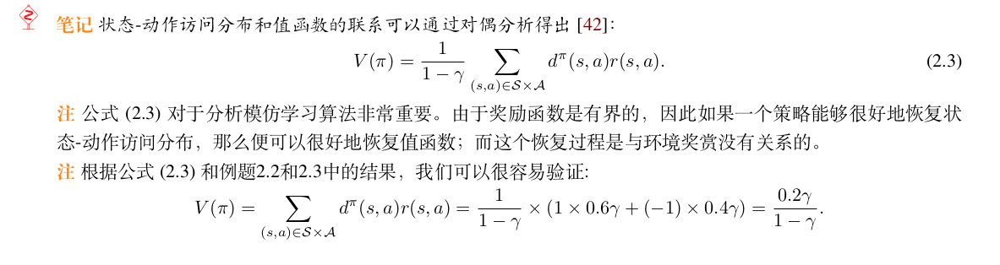
[马尔科夫链的讲解](https://developer.aliyun.com/article/1210446#/)

对于强化学习：
$$
\pi^* \in argmax_{\pi} V(\pi)
$$
对于模仿学习，已知有一个专家策略表现较好，智能体的累计回报与专家策略的累计汇报接近
$$
min_{\pi}V(\pi^E) - V(\pi)
$$
所展示的优化问题在一定程度上可以视为最大化 V (π)，这个目标和强化学习的目标是一致的。但是与强化学习的区别有：1）在模仿学习中，最大化 V (π) 的过程里是不知道奖赏函数的；2）反而，智能体被提供专家示例来进行策略优化。

专家策略可以和环境进行交互产生一系列的状态动作对，这些状态动作对使用轨迹tr表示，m条轨迹组成专家示例D = {tr_i}
## Behavioral Cloneing
直接从数据中估计$\pi^E$可以使用最大似然估计
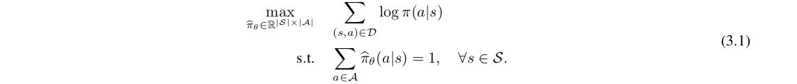
对于有限状态和动作空间的马尔科夫决策过程，估计公式为：
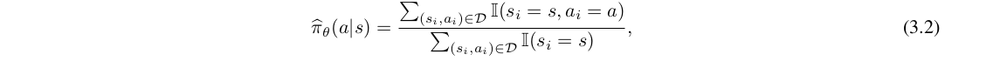
上述方法一般称为直接参数化
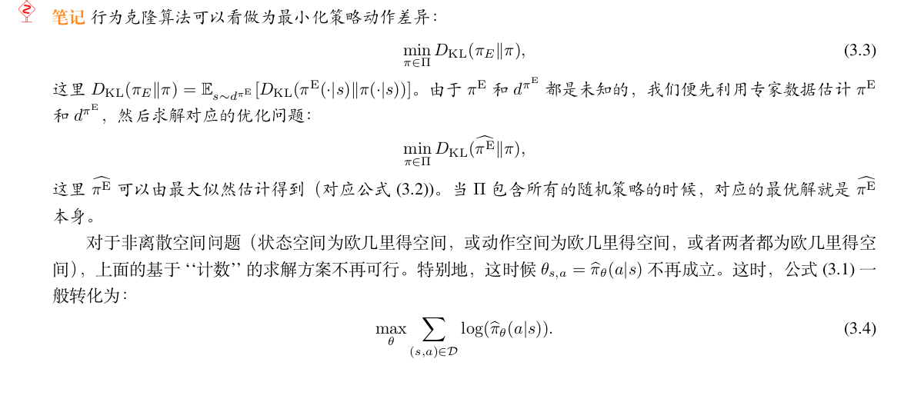
当在某些状态上没有专家示例，BC会采取一个均匀分布的策略
存在缺点： 复合误差compounding error、
在行为克隆中，复合误差是评估克隆模型预测与实际行为之间差异的一种度量。它通常是通过比较模型预测的行为与实际观察到的行为之间的差异来计算的。具体来说，对于每个观测样本，可以计算模型预测的输出与实际输出之间的误差，然后将这些误差进行汇总以得到整体的复合误差。

复合误差可以有多种度量方式，常见的包括均方误差（Mean Squared Error，MSE）、平均绝对误差（Mean Absolute Error，MAE）等。这些度量方式可以根据具体的问题和需求进行选择。

在行为克隆中，通过评估复合误差可以了解模型的预测能力和准确性，从而帮助选择合适的克隆模型或者调整模型的参数，以提高克隆模型的性能和泛化能力。
值函数可以表示为状态-动作访问分布与奖励相乘的累加形式
$$
V(\pi) = \frac{1}(1 - \lambda) \sum_{(s, a)} s^{\pi}(s,a) r(s, a)
$$
可以发现评估测试使用的策略的状态动作访问分布与训练集的状态动作分布不太一致，但两个策略的值函数的差异可以被两个策略的状态-动作访问分布间的差异所界（bound）住:
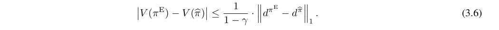
引理：
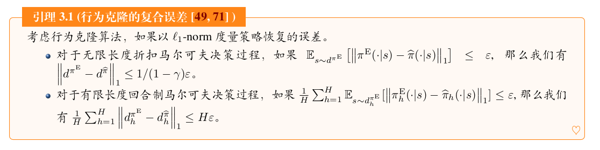
样本复杂度
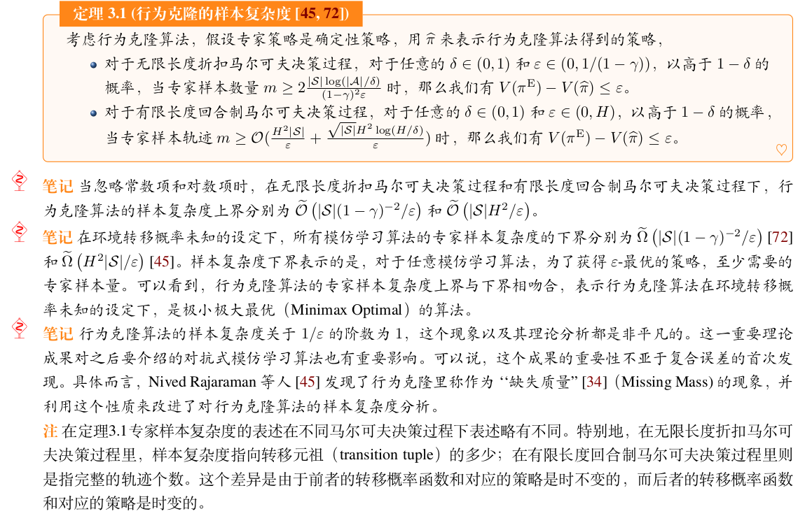
DAgger算法
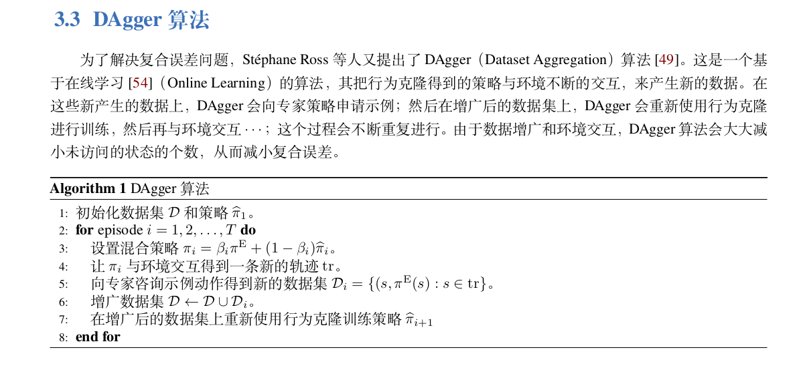

行为克隆是一个简单有效的算法。尽管行为克隆存在复合误差的问题，但这个问题可以认为是问题提供的信息有限（也就是说，学习者只被提供了一个包含专家状态和动作的数据集）。在不改变问题设定的前提下，可以从信息论的角度证明，任何算法（包括但不限于行为克隆）在最坏的情况下都会存在复合误差的问题.

## Adversarial Imitation Learning
当模仿策略的状态-动作分布$P_h^\pi$ 和专家策略的状态-动作分布$P_h^\pi$之间的距离很小时，模仿学习的目标“最小化专家策略和训练策略之间的差别”也会很小， 生成对抗式模仿学习就是基于“状态-动作分布匹配”, $\psi$是一种距离度量
$$
min_{\pi \in \Pi} \sum_{h = 1} ^{H}\psi (P_h^\pi, P_h^{\pi^E})
$$
‘‘状态-动作分布匹配’’ 准则的优势在于：即使在数据集未被访问的状态上，‘‘状态-动作分布匹配’’ 准则也会帮助选择能够接近专家状态-动作分布的动作。模仿策略会避免访问坏状态(专家数据集中没有)，而是在已知的状态中选择执行专家动作，避免复合误差的产生。如果在 ‘‘策略分布匹配’’ 的准则下，在未被访问的状态上，模仿策略会采取一个均匀分布的策略，从而以一定的概率转移到坏状态 b 上，再也不能得到奖赏，产生较大的复合误差。相比于行为克隆中 ‘‘策略分布匹配’’
的准则，生成对抗式模仿学习中 ‘‘状态-动作分布匹配’’ 的准则可以降低复合误差，提升模仿策略的累计回报。

但我们不知道专家策略的状态-动作分布，根据数据集构建的最直接方法是最大似然估计：
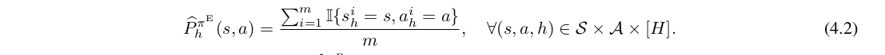
根据状态-动作分布匹配原则，学习到的策略与专家策略的动作分布差异未必是很小的，甚至是不随着训练过程单调递减的；这个现象在专家数据贫乏的时候尤为显现。具体而言，智能体会倾向于选择任何可以使得产生的状态-动作分布能够与专家匹配的
动作，而这样的动作不一定只是专家动作。因此不能直接把前面提到的行为克隆的损失函数作为对抗式模仿学习的评估准则（Validation Metric）和实验分析的指标。
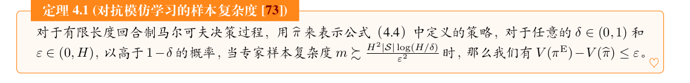
对于任何一个 f -距离，我们都可以通过相应的对偶表示，得到对应的极小极大化目标(f 是一个凸函数)
建模过程：
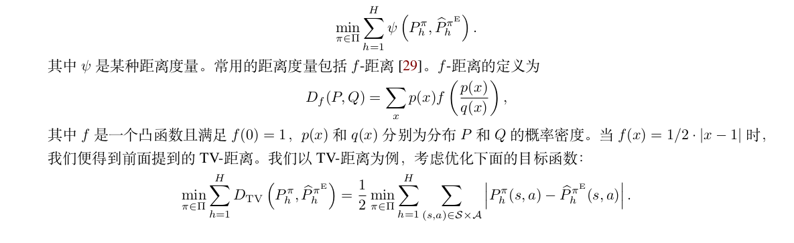
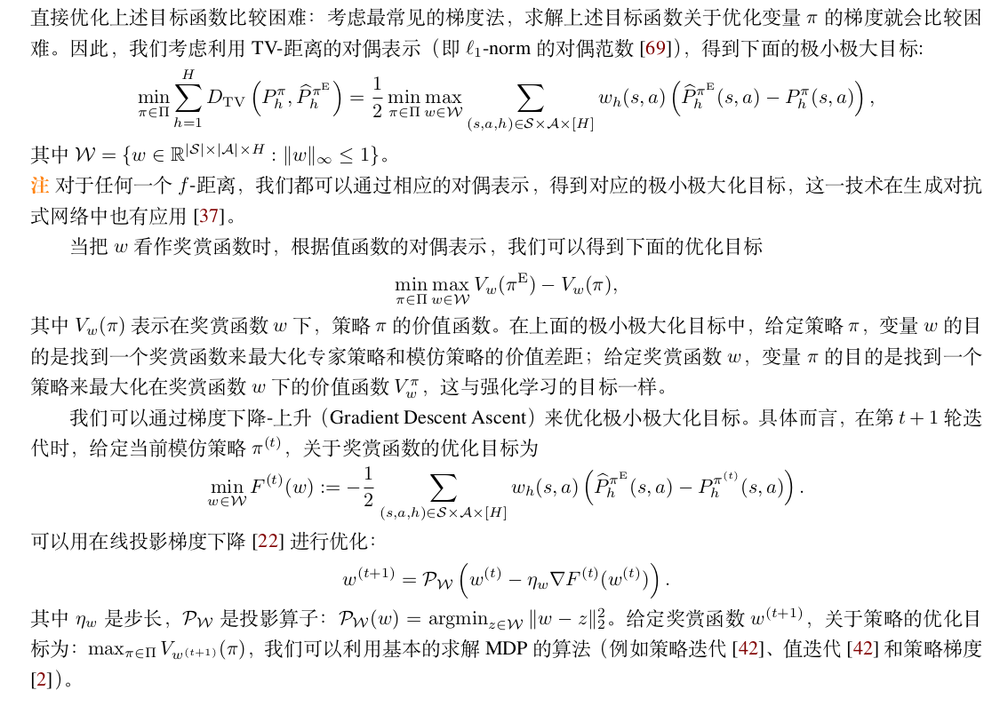
学徒学习：
经典的学徒学习算法Feature Expectation Matching（FEM）和 Game Theoretic Apprenticeship Learning （GTAL）也可以被对抗式模仿学习的框架所描述。作者假设真实的奖赏函数可以被一组已知的特征线性表示，对于任意一个策略，他的特征期望是：
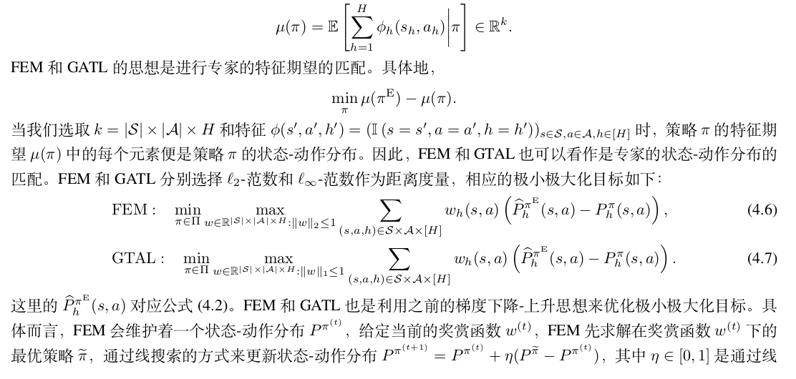
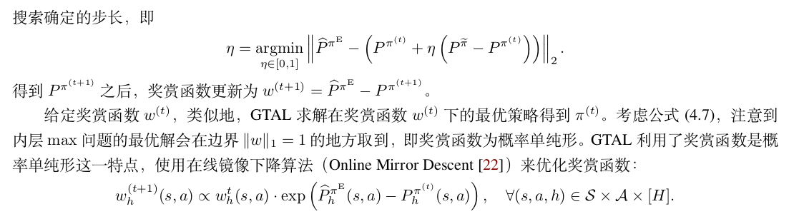
生成对抗式模仿学习
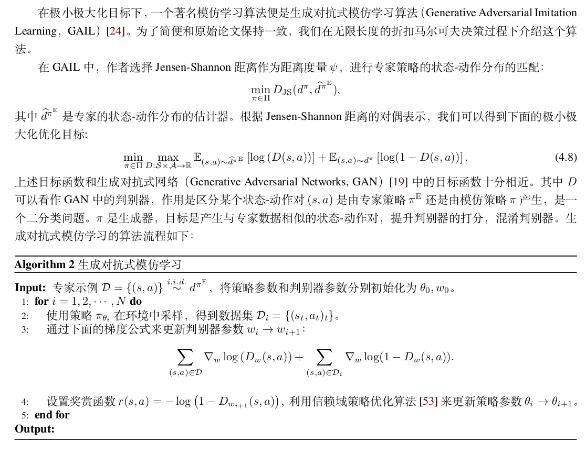
更高级的对抗模拟学习方法
相比于 BC 遵循的 ‘‘策略分布匹配’’ 准则，‘‘状态-动作分布匹配’’ 准则能够降低复合误差。但是，经典的对抗式模仿学习算法在最坏情况下的样本复杂度未必比行为克隆好。我们假设算法已知环境的转移概率并且专家策略是一个确定性策略。
TAIL:
新的动作-状态分布的第一部分是使用转移概率准确计算得到的，第二部分使用最大似然估计得到的，比全部使用最大似然估计得到的结果误差更小一点。
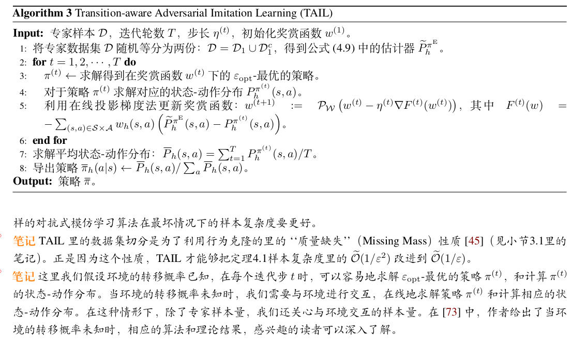

