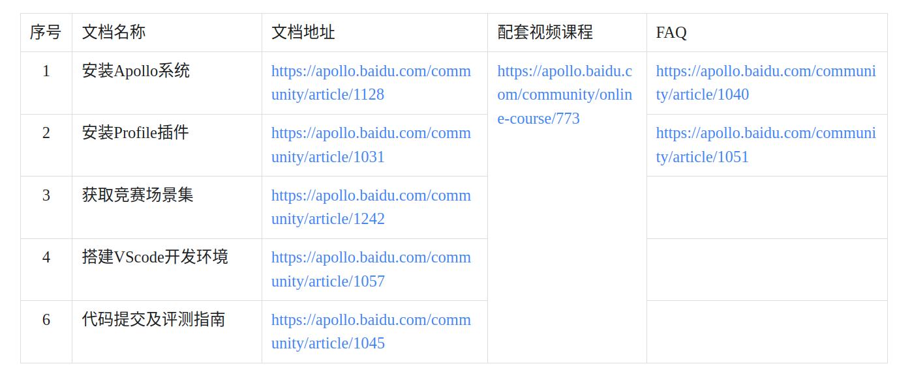
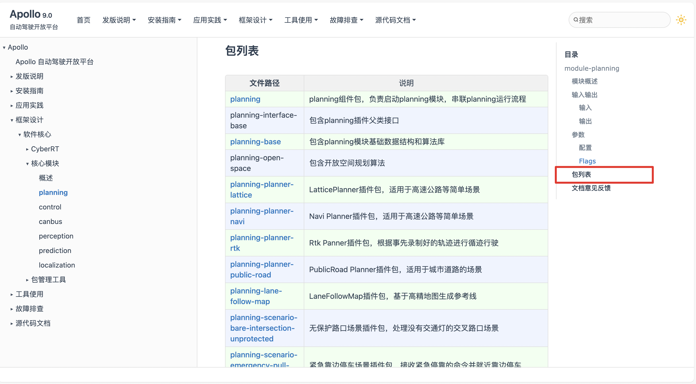

# 星火2024
## 代码安装
[第二阶段](https://apollo.baidu.com/community/article/1243)

也可以使用K330的电脑，上面场景已经布置好
## 入门教程(看一下直播回放中相关内容即可)
https://apollo.baidu.com/community/online-course/814
## driveview++使用
```bash
# 启动
aem bootstrap start --plus
# 停止
aem bootstrap stop
```
启动后，浏览器打开`http://localhost:8888/`
选择左下角资源中心，场景，下载`xh_2024_scenairos`场景，其中是本次竞赛的六个场景

## 下载，修改代码，编译
```bash
# 下载交通规则中crosswalk的代码
buildtool install planning-traffic-rules-crosswalk
# 编译
buildtool build -p modules/planning
```
apollo-planning中所有包`https://apollo.baidu.com/docs/apollo/latest/md_collection_2planning_2README__cn.html`


## 场景一 车辆靠边启动
安装`planning-scenario-park-and-go`包
```bash
# 安装package
buildtool install planning-scenario-park-and-go
# 配置参数同步
buildtool profile config init --package planning-scenario-park-and-go --profile=default
# 使用default配置参数
aem profile use default
# TODO:好像不需要更改参数
```

## 场景二 红绿灯路口-行人避让
修改交通规则包，apollo默认避让行人，但不会等行人完全通过人行道才启动
该交通规则的官方文档`https://apollo.baidu.com/community/Apollo-Homepage-Document?doc=BYFxAcGcC4HpYIbgPYBtXIHQCMEEsATAV0wGNkBbWA5UyRFdZWVBEAU0hFgoIH0KyYqk58ATOFYA7KXikBzcSABOCAGZq8pPn2VERkcaWXJIkAO4JUAa3EAlAKIBBACIBZBztJTMoCqiA`
```bash
# 安装package
buildtool install  planning-traffic-rules-crosswalk
# 配置参数同步
buildtool profile config init --package planning-traffic-rules-crosswalk --profile=default
# 使用default配置参数
aem profile use default
# 修改人行道中default_conf.pb
stop_distance: 1.7
max_stop_deceleration: 4.0
min_pass_s_distance: 1.0
expand_s_distance: 2.0
stop_strict_l_distance: 1.0
stop_loose_l_distance: 5.8
stop_timeout: 50.0
# 修改相应代码，满足行人不在人行道后才通行

```

## 场景三 红绿灯路口-行人避让
新增交通规则插件:[参考](https://apollo.baidu.com/community/article/1253)
在上边的基础上，将pnc_junction_overlap()转换为crosswalk_overlap
调整相应参数


## 代码提交
[练习赛](https://apollo.baidu.com/community/competition/29?tab=submit)
将application-pnc/moulds与application-pnc/profiles放在一个文件夹下,
`tar -zcvf baseline.tar.gz modules/planning/ profiles/default/
modules/planning/`提交到练习赛链接中


