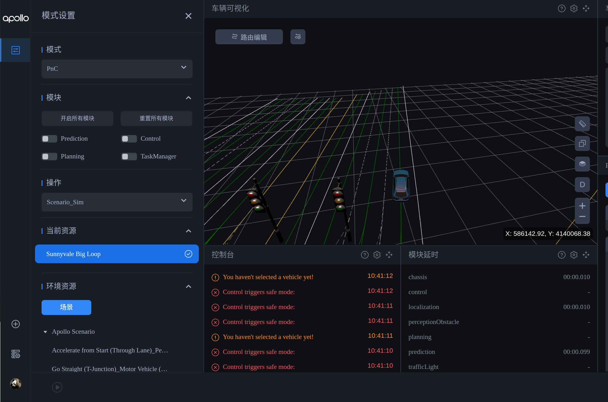

# apollo简单教程
# 备忘：比赛采取双报名
[链接](https://apollo.baidu.com/community/article/1038)

## 基本流程
1.熟悉一下dreamview的使用
2.简单熟悉一下planning模块 中基本概念
3.把前三道题做一下

## dreamview使用
简单使用:
右下角个人中心->设置->语言(可以选择中文)
右下角资源管理->场景->xh_2024_scenarios中是本次比赛的六个场景
左上角选择'模式设置', 模式选择'Pnc', 操作选择` Scenario_Sim`


ps: 使用自己的账号的dreamview比较麻烦，需要在[appo_studio](https://apollo.baidu.com/workspace/scenario-manage/scenario-set-management?tabKey=collection)中申请一个个人服务(仿真)，用于生成登陆dreamview账号密钥，并且要在appo_studio中新建场景集并且导入场景等工作，**比较麻烦**，我认为还是用我的账号吧(K330中电脑已登陆)。

## 简单熟悉apollo-planning模块
[pnc基础课程](https://apollo.baidu.com/community/online-course/776) :简单看看第一课，第二课，了解一下planning中的各个包的简单功能和简单的参数调试，了解场景，策略，任务等调用流程
[pnc开发模式说明](https://apollo.baidu.com/community/article/1261) ：这里主要是常见命令的汇总
**重要的三个链接:**
[赛事备赛课程](https://apollo.baidu.com/community/online-course/814): 主要是**直播回放**（跳转前边的赛事介绍等到到相应的赛题解析，可以看一下当做入门）中有前三道题的解析，第六课是满分的情况，其余课感觉可以不看
[往届赛题集锦](https://apollo.baidu.com/community/article/1258) ： 有调参有新建插件等工作内容，并且有与本次比赛相似的场景
[赛事讨论贴](https://apollo.baidu.com/community/article/1243)：各种问题的汇总

## 简单跑一下前三道题
简单过一遍流程大概1~3h以内，moudles中是代码，profiles/default中是配置参数
### 场景一 车辆靠边启动
安装`planning-scenario-park-and-go`包
```bash
# 安装package
buildtool install planning-scenario-park-and-go
# 配置参数同步
buildtool profile config init --package planning-scenario-park-and-go --profile=default
# 使用default配置参数
aem profile use default
```
在此基础上通过运行仿真，查看通过了什么stage，参数应该不需要更改，只需要加一下`open_space_trajectory_provider.pb.txt`文件，如参考文件中

### 场景二 红绿灯路口-行人避让
修改交通规则包，apollo默认避让行人，但不会等行人完全通过人行道才启动
该交通规则的官方文档`https://apollo.baidu.com/community/Apollo-Homepage-Document?doc=BYFxAcGcC4HpYIbgPYBtXIHQCMEEsATAV0wGNkBbWA5UyRFdZWVBEAU0hFgoIH0KyYqk58ATOFYA7KXikBzcSABOCAGZq8pPn2VERkcaWXJIkAO4JUAa3EAlAKIBBACIBZBztJTMoCqiA`
```bash
# 安装 crosswalk package
buildtool install  planning-traffic-rules-crosswalk
# 配置参数同步
buildtool profile config init --package planning-traffic-rules-crosswalk --profile=default
# 使用default配置参数
aem profile use default
# 修改人行道中default_conf.pb
stop_distance: 1.5
max_stop_deceleration: 4.0
min_pass_s_distance: 1.0
expand_s_distance: 2.0
stop_strict_l_distance: 1.0
stop_loose_l_distance: 5.8
stop_timeout: 50.0
# TODO: 增加交通规则插件
```
```cpp
// 修改相应代码，满足行人不在人行道后才通行
} else {
    // (4) when l_distance is between loose_l and strict_l
    //     use history decision of this crosswalk to smooth unsteadiness

    // TODO(all): replace this temp implementation
    if (is_path_cross) {
        stop = true;
    }
    ADEBUG << "need_stop(between l1 & l2): obstacle_id[" << obstacle_id << "] type[" << obstacle_type_name
            << "] obstacle_l_distance[" << obstacle_l_distance << "] crosswalk_id[" << crosswalk_id
            << "] USE_PREVIOUS_DECISION";
    // 新增
    stop = true;
}
```
目前存在问题：
增加交通规则插件之后，时间超出限制，还需要加快速度，暂未解决

### 场景三 路口减速
新增交通规则插件:[参考](https://apollo.baidu.com/community/article/1253)
在上边的基础上，将pnc_junction_overlap()转换为crosswalk_overlap()
调整相应参数，将速度限制在5m/s 内

## 简单实验
配置dreamview场景比较麻烦，我认为可以先不做

## 常用指令
```bash
# 启动driveview++
aem bootstrap start --plus
# 停止driveview++
aem bootstrap stop

# 下载apollo已有内容
# 如：下载交通规则中crosswalk的代码
buildtool install planning-traffic-rules-crosswalk
# 如：下载park-and-go场景
buildtool install planning-scenario-park-and-go
# 编译planning模块如整个planning,
buildtool build -p modules/planning
# 编译建通规则
buildtool build -p modules/planning/traffic_rules

# 参数配置
# 在profiles中生成相应参数，如生成crosswalk参数
buildtool profile config init --package planning-traffic-rules-crosswalk --profile=default
# 指定使用参数目录
aem profile use default
# 后续参数在application-pnc/profiles/default中修改即可，不需要在moulds中修改

# 新建插件
# 根据事先定义好的基类生成交通规则模板
buildtool create --template plugin \
                 --namespaces planning \
                 --name region-speed-limit \
                 --base_class_name TrafficRule modules/planning/traffic_rules/region_speed_limit \
                 --config_message_name RegionSpeedLimitConfig

```