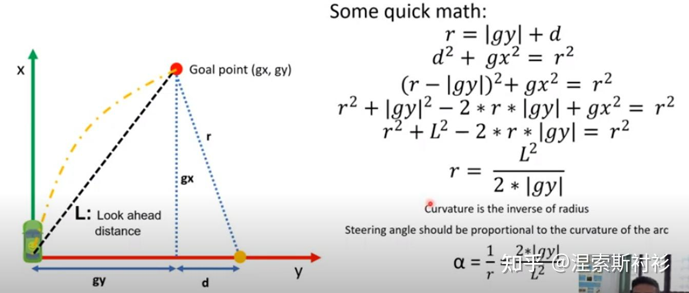
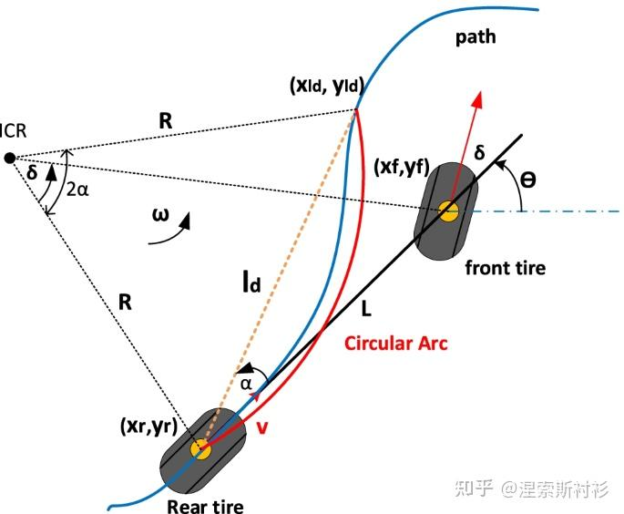

# Pure Pursuit
基本思想：计算车辆当前位置到预瞄点（goal point）的曲率，使得车辆沿着经过预瞄点的圆弧行驶，实现轨迹跟踪，所以算法的核心在于通过设计合理的预瞄距离，进而计算轨迹跟踪的控制曲率。
## 求曲率
1.几何法

2.自行车模型求

$$
k = \frac{e_y}{l_d^2} * 2
$$
其中$e_y$表示目标点（goal point）与当前点（current point）的横向误差
3.阿克曼转角的计算公式
$$
tan(\delta) = L / R; steering = K * \delta
$$
## 预瞄点的选择
最近点选择：在路径上选择距离当前位置最近的点作为目标点
前瞻点选择： 距离当前位置L一定距离的点,如果L上没有点，则在左右最近的两个点进行插值

## 预瞄距离的选择
Pure Pursuit本质上是一个与预瞄距离有关的比例控制器($K_p = 2 / (L^2)$)，当预瞄距离(lookahead distance)L越小时，比例控制器系数越大。由基本的控制原理不难理解，系统的响应越快，跟踪性能更灵敏；而当预瞄距离(lookahead distance)越大时，比例控制器系数越小，系统的响应较慢，容易造成较大的跟随误差。为增加鲁棒性，可以根据车速动态调整预瞄距离的大小。