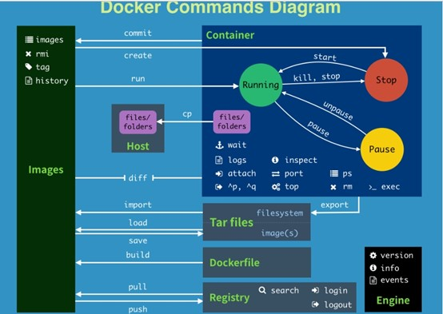
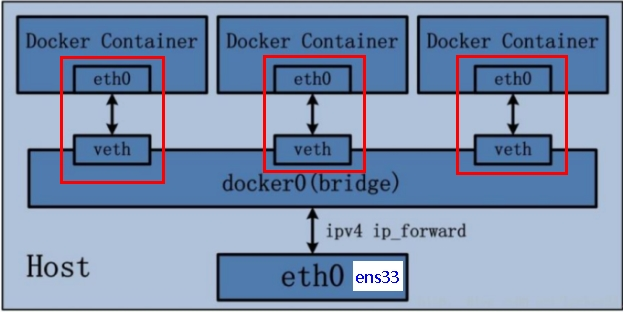
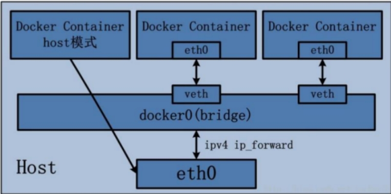
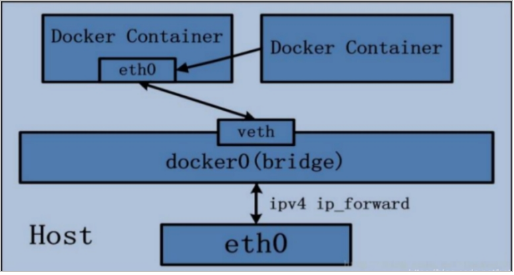

# docker
[教程1](https://yeasy.gitbook.io/docker_practice/underly/ufs)
## docker 简介

**容器**： 系统平滑移植， 容器虚拟化技术

镜像就是应用：包括源码、配置环境、运行环境、运行依赖包、甚至内核等等

基于Go语言的云开源项目，“build, ship and run any app, anwhere",通过对应用组件的封装、分发、部署、运行等生命周期的管理，使用户的APP及运行环境做到“一次镜像，处处运行"

虚拟机缺点： 启动慢，资源占用多，冗余步骤多

linux 容器：与系统其他部分隔离开的一系列进程，从另一个镜像运行，由该镜像提供支持进程所需的全部文件，包含应用的所有依赖项。

容器中进程直接运行于宿主的内核，没有硬件虚拟


## docker基本组成

- 镜像（image)
  类似类模板，类的定义，一个只读的模板，可以用于创建多个容器；轻量级可执行的独立软件包，包含运行某个软件所需的所有内容（代码，运行所需的库，配置等），打包好的环境即可称为镜像。
- 容器(container)
  类似**根据类模板实例化**，容器时用镜像创建的运行实例，每个容器相互隔离，保证安全。可以视为简易版linux环境和运行在其中的应用程序。
- 仓库(repository)
  存放镜像文件的场所，docker hub,国内的公开仓库，阿里云和网易云等等

docker 是一个Client-Server结构的系统，守护进程运行在主机上，通过Socker连接从客户端访问，守护进程从客户端接受命令并管理运行在主机上的容器。后端是一个松耦合的架构，众多模块各司其职。

基本架构：

运行流程如下：

1.用户使用Docker Client与 Docker Daemon建立通信，并发送请求给后者。

2.Docker Daemon作为Docker架构主体部分，首先提供Docker Server的功能使其可以接受Docker Client的请求。

3.Docker Engine 执行Docker 内部的一系列工作，每一项工作以job行书存在；

4.job运行过程中，当需要容器镜像时，从Docker Registry中下载镜像，并通过奖项管理驱动Graph driver 将下载的镜像以Graph的形式存储

5.当需要为Docker创建网络环境时，通过网络管理驱动Network driver创建并配置Docker容器网络环境。

6.当需要限制Docker容器运行资源或执行用户指令等操作，通过Exec driver完成。

7.Libcontainer是一项独立的容器管理包，Network driver及Exec driver都是通过Libcontainer实现对容器的操作。

小总结：

docker 相较于虚拟机有更少的抽象层，不需要进行硬件资源虚拟化

docker使用宿主机的内核，不需要加载操作系统OD内核

## docker 安装

docker并非一个通用的容器工具，依赖于正在运行的linux内核环境，其他系统想要使用，需要部署一个虚拟的linux环境

[docker官网](https://www.docker.com/)

[docker hub](https://hub.docker.com)

#### 安装

- 首先卸载旧版本

  ```
  bash
  sudo apt-get remove docker docker-engine docker.io containerd runc
  ```
  
- 安装

  ```
  bash
  # 更新
  sudo apt update
  # 安装依赖项
  sudo apt install apt-transport-https ca-certificates curl gnupg2 software-properties-common
  # 配置密钥（使用阿里云)
  curl -fsSL https://mirrors.aliyun.com/docker-ce/linux/ubuntu/gpg | sudo apt-key add -
  # 添加软件源
  sudo add-apt-repository \
      "deb [arch=amd64] https://mirrors.aliyun.com/docker-ce/linux/ubuntu \
      $(lsb_release -cs) \
      stable"
  # 更新
  sudo apt-get update
  # 安装最新版
  sudo apt-get install docker-ce docker-ce-cli containerd.io docker-buildx-plugin docker-compose-plugin
  # 安装指定版本
  # 显示支持的版本
  apt-cache madison docker-ce | awk '{ print $3 }'
  # 选择所需版本安装
  VERSION_STRING=5:24.0.0-1~ubuntu.22.04~jammy
  sudo apt-get install docker-ce=$VERSION_STRING docker-ce-cli=$VERSION_STRING containerd.io docker-buildx-plugin docker-compose-plugin
  # 验证 使用docker命令必须加sudo,不然没有该命令
   sudo docker run hello-world
  
  ```
  
- 镜像加速  
在[阿里云](https://cr.console.aliyun.com/cn-beijing/instances)中查找容器镜像服务，创建一个个人实例,
配置镜像加速器的代码如下,通过修改daemon配置文件/etc/docker/daemon.json来使用加速器
```bash
sudo mkdir -p /etc/docker
sudo tee /etc/docker/daemon.json <<-'EOF'
{
  "registry-mirrors": ["https://no3yzdiu.mirror.aliyuncs.com"]
}
EOF
sudo systemctl daemon-reload
sudo systemctl restart docker
```
-   

## docker常见命令

### 帮助启动类命令

```bash
# 启动docker
sudo systemctl start docker
# 停止docker
sudo systemctl stop docker
# 重启docker
sudo systemctl restart docker
# 查看docker状态
sudo systemctl status docker
# 开机启动
sudo systemctl enable docker
# 查看docker概要信息
sudo docker info
# 查看docker总体帮助文档
sudo docker --help
# 查看docker命令帮助文档
sudo docker 具体命令 --help
```

### 镜像命令

```bash
# 罗列本地的镜像
docker images
# 其中REPOSITORY代表仓库源，TAG代表镜像标签，版本号，IMAGE ID,镜像ID, CREATED:镜像创建时间， SIZE,镜像大小
-a # 列出本地所有镜像，含历史镜像层
-q # 只显示镜像ID

# 查某个镜像的
docker search image-name(hello-world)
-- limit number # 只罗列出n个镜像
docker search -- limit number image-name(hello-world)

# 下载镜像
docker pull image-name:TAG # 没有tag,默认最新版

# 查看镜像/容器/数据卷所占空间
sudo docker system df

# 删除
docker rmi image-ID
-f  # 强制删除
docker rmi -f $(docker images -qa)  # 全部删除
```

docker 虚悬镜像： 仓库名和标签都是`<none>`的镜像,及虚悬镜像 dangling image

 ### 容器命令

有镜像才能创建容器
docker容器中使用gpu
安装[nvidia-container-runtime](https://nvidia.github.io/nvidia-container-runtime/),其中Debian-based是ubuntu的类型
```bash
# 新建 script.sh 写入内容，执行sh script.sh
curl -s -L https://nvidia.github.io/nvidia-container-runtime/gpgkey | \
  sudo apt-key add -
distribution=$(. /etc/os-release;echo $ID$VERSION_ID)
curl -s -L https://nvidia.github.io/nvidia-container-runtime/$distribution/nvidia-container-runtime.list | \
  sudo tee /etc/apt/sources.list.d/nvidia-container-runtime.list
sudo apt-get update

# 安装nvidia-container-runtime
sudo apt-get install nvidia-container-runtime
systemctl restart docker #重启docker
# 在创建容器时加入*****
sudo docker run --gpus all -it --name fyx_python fyx_anaconda_image /bin/bash
```


```bash
# 新建并启动容器
sudo docker run [OPTIONS] IMSGE [COMMAND] [ARG..]
# options常见指令
--name="容器新名字"
-d  # 后台运行容器并返回容器id,启动守护式容器
-i  # 以交互模式运行容器，通常与-t同时使用
-t  # 为容器重新分配一个伪输入终端，与-i同时使用
sudo docker run -it iamge-name /bin/bash   # /bin/bash 表示在容器中执行命令

# 上述及时启动交互式容器（前台有伪终端，等待交互）
-P  # 指定端口映射
-P  # 随机端口映射,一般使用 -p 6379:6379

# 列出当前正在运行的容器 
docker ps [OPTIONS]
-a  # 所有容器，包括历史信息
-l  # 显示最近创建的容器
-n number  # 显示最近n个创建的容器
-q  # 静默模式，只显示容器编号

# 退出当前容器
exit  # 容器退出
ctrl+p+q  # 容器不退出

# 启动已经停止的容器
docker start 容器ID或容器名

# 重启容器
docker restart container-ID

# 停止容器
docker stop contaner-id

# 强制停止容器
docker kill container-id

# 删除已经停止的容器
docker rm container-id

# 查看容器日志 
docker logs container-id

# 查看容器内运行进程
docker top container-id

# 查看容器内部细节
docker inspect

# 进入正在运行的容器以命令行交互
docker exec -it container-id bashSheel  # 对应ctrl+p+q的退出形式， 推荐
docker attach container-id
# 两者区别， attach 直接进入容器启动命令的终端，不会启动新的进程，exit 会同志容器
# exec 在容器中打开新的终端，并且可以启动新的进程，exit不会停止容器

# 从容器内拷贝文件到主机上
docker cp container-id:path_of_container root_path

# 导入和导出容器
export  # 导出容器的内容作为一个tar归档文件
docker export container-id > file_name.tar

import  # 从tar包中内容创建一个新的文件系统再导入镜像, docker images直接查看
cat file_name.tar | docker import -image_user/image_name:image_tag
 
 docker commit  # 提交容器副本，称为新的镜像
 docker commit -m="massages" -a="creater" container_ID new_image_name:tag_name

 # 推送到其他仓库
 docker push

 docker pull registry # 搭建私有仓库


 docker login  # 登录docker hub帐号

 # 容器关闭后重启
 docker start container_name
 docker exec -it container_name /bin/bash

```

`docker run -d image-name`问题：docker容器后台运行，必须有一个前台进程，如果容器运行的命名不是那些一直挂起的命令（top, tail等），会自动退出。应该根据具体情况，比如ubuntu,一般需要-it, 而mysql等需要后台运行。



```bahs
attach    Attach to a running container                 # 当前 shell 下 attach 连接指定运行镜像
build     Build an image from a Dockerfile              # 通过 Dockerfile 定制镜像
commit    Create a new image from a container changes   # 提交当前容器为新的镜像
cp        Copy files/folders from the containers filesystem to the host path   #从容器中拷贝指定文件或者目录到宿主机中
create    Create a new container                        # 创建一个新的容器，同 run，但不启动容器
diff      Inspect changes on a container's filesystem   # 查看 docker 容器变化
events    Get real time events from the server          # 从 docker 服务获取容器实时事件
exec      Run a command in an existing container        # 在已存在的容器上运行命令
export    Stream the contents of a container as a tar archive   # 导出容器的内容流作为一个 tar 归档文件[对应 import ]
history   Show the history of an image                  # 展示一个镜像形成历史
images    List images                                   # 列出系统当前镜像
import    Create a new filesystem image from the contents of a tarball # 从tar包中的内容创建一个新的文件系统映像[对应export]
info      Display system-wide information               # 显示系统相关信息
inspect   Return low-level information on a container   # 查看容器详细信息
kill      Kill a running container                      # kill 指定 docker 容器
load      Load an image from a tar archive              # 从一个 tar 包中加载一个镜像[对应 save]
login     Register or Login to the docker registry server    # 注册或者登陆一个 docker 源服务器
logout    Log out from a Docker registry server          # 从当前 Docker registry 退出
logs      Fetch the logs of a container                 # 输出当前容器日志信息
port      Lookup the public-facing port which is NAT-ed to PRIVATE_PORT    # 查看映射端口对应的容器内部源端口
pause     Pause all processes within a container        # 暂停容器
ps        List containers                               # 列出容器列表
pull      Pull an image or a repository from the docker registry server   # 从docker镜像源服务器拉取指定镜像或者库镜像
push      Push an image or a repository to the docker registry server    # 推送指定镜像或者库镜像至docker源服务器
restart   Restart a running container                   # 重启运行的容器
rm        Remove one or more containers                 # 移除一个或者多个容器
rmi       Remove one or more images       # 移除一个或多个镜像[无容器使用该镜像才可删除，否则需删除相关容器才可继续或 -f 强制删除]
run       Run a command in a new container              # 创建一个新的容器并运行一个命令
save      Save an image to a tar archive                # 保存一个镜像为一个 tar 包[对应 load]
search    Search for an image on the Docker Hub         # 在 docker hub 中搜索镜像
start     Start a stopped containers                    # 启动容器
stop      Stop a running containers                     # 停止容器
tag       Tag an image into a repository                # 给源中镜像打标签
top       Lookup the running processes of a container   # 查看容器中运行的进程信息
unpause   Unpause a paused container                    # 取消暂停容器
version   Show the docker version information           # 查看 docker 版本号
wait      Block until a container stops, then print its exit code   # 截取容器停止时的退出状态值

```


### 镜像底层实现
docker镜像层都是**只读的**,容器层是可写的，容器启动时，新的可写层加载到镜像层的顶部，及容器层

#### 联合文件系统
联合文件系统（UnionFS）是一种分层、轻量级并且高性能的文件系统，它支持对文件系统的修改作为一次提交来一层层的叠加，同时可以将不同目录挂载到同一个虚拟文件系统下(unite several directories into a single virtual filesystem)。  
联合文件系统是 Docker 镜像的基础。镜像可以通过分层来进行继承，基于基础镜像（没有父镜像），可以制作各种具体的应用镜像。  
另外，不同 Docker 容器就可以共享一些基础的文件系统层，同时再加上自己独有的改动层，大大提高了存储的效率。  
Docker 中使用的 AUFS（Advanced Multi-Layered Unification Filesystem）就是一种联合文件系统。 AUFS 支持为每一个成员目录（类似 Git 的分支）设定只读（readonly）、读写（readwrite）和写出（whiteout-able）权限, 同时 AUFS 里有一个类似分层的概念, 对只读权限的分支可以逻辑上进行增量地修改(不影响只读部分的)。  
分层的好处：可以共享资源。方便复制迁移，复用，相同的base镜像进需要存一份


### docker容器数据卷
`docker`在挂载主机目录访问时，加入`--privileged-true`,开启后，container内的root才是真正的root,
数据卷的作用，通过映射，将容器内数据备份并持久化到主机目录   
卷是目录和文件，存在一个或多个容器，不属于联合文件系统，完全独立于容器的生存周期,自动备份
基本命令：
```bash
docker run -it --privileged=true -v 宿主机绝对路径目录:/容器内目录 image_name
# 其中默认为读写权限，容器目录:rw,可以改成只读,容器目录:ro
container:cf079dfd2168

# 继承容器卷, 数据共享， 两个容器之间数据也是共享，**继承的是路径**
docker run -it --privileged=true --volumes-from fa_container_name --name new_container_name image_name 
```
### docker安装软件
基础步骤： 搜索镜像， 拉取镜像，查看镜像，启动镜像，停止容器，移除容器


### Dockerfile
dockerFile是用来构建Docker镜像的文本文件，是由一条条构造镜像所需的指令与参数构成的脚本
三个步骤：1.编写DockerFile文件，2. docker build 命令构建镜像； 3.docker run 依托镜像启动容器
基础知识：
1. 每个保留字指令必须大写且豁免至少需要跟随一个参数
2. 指令从上到下依次执行
3. #表示注释
4. 每条指令都会创建新的镜像层并对镜像层进行提交
Docker 执行DockerFile的大致流程：
docker 从基础镜像运行一个容器；
执行一条指令并对容器作出修改
执行类似docker commit的操作提交一个新的镜像层
docker 再基于刚提交的镜像运行一个新容器
执行dockerfile中的下一条指令直到所有指令都执行完成
常用保留字：
```bash
FROM   # 基础镜像，指定一个已经存在的镜像作为模板，一般是DockerFile的第一行
MAINTAINER   # 镜像维护者姓名与邮箱
RUN　<命令行命令>   #　容器构建时需要运行的命令，可以使用shell　或　exec格式,在Docker build 运行
RUN apt-get install vim
EXPOSE  # 当前容器对外暴露的端口
WORKDIR  # 指定创建容器后，终端默认登陆进来的工作目录，一个落脚点
USER  # 指定该镜像应该以什么用户去执行，若都不指定，默认是root

ENV key=value # 构建镜像过程中配置环境变量
ENV MY_PATH /user/mytest  # 该环境变量能在后续指令中直接使用这些环境变量
WORKDIR $MY_PATH

VOLUME  # 容器数据卷，数据保存与持久化动作

ADD  # 将宿主机目录下的文件拷贝进镜像并自动处理URL后解压tar压缩包
COPY  # 类似ADD 
COPY src dest   # src 源路径； dest 容器内指定路径，不用事先建立好，可自动创建

CMD  # 指定容器启动后要干的事，可以存在多个CMD，但只有最后一个CMD有效，并且docker run 后的参数会覆盖CMD内容，可能导致其不生效

ENTRYPOINT   # 类似CMD。两者一起使用时，cmd相当于给entrypoint 传参，且entrypoint 不会被docker run后面的指令覆盖

ENTRYPOINT [“nginx”, "-c"]     #定参
CMD ["/etc/nginx/nginx.conf"]  # 变参  会根据docker run 后面的参数进行改变

```
构建 `docker build -t new_images_name:TAG .` 在Dockerfile目录下

虚悬镜像的查找与删除
```bash
docker ls -f dangling=true

docker images prune

```
### Docker network
功能： 容器之间互联通信及端口映射，容器IP变动时可通过服务名直接网络通信而不受影响
```bash
sudo docker network --help 

connect     Connect a container to a network
create      Create a network
disconnect  Disconnect a container from a network
inspect     Display detailed information on one or more networks
ls          List networks
prune       Remove all unused networks
rm          Remove one or more networks

sudo docker network inspect network_name

```

网络类型：5种，**`brige`, `host`**. `none`, `container`, 以及自定义模式
- bridge 
为每一个容器分配，设置一个IP，并将容器连接到一个docker0虚拟网桥，默认模式；
Docker服务器会默认创建一个docker0网桥（存在 docker0内部接口），桥接网络的名称为docker0, 在**内核层**连通其他物理或虚拟网卡，使得容器与本机放在同一个物理网络。Docker 默认指定docker0 的IP与子网掩码。主机与容器可以通过网络互相通信。  
宿主机上所有容器都连接到这个内部网络上，从网管中拿到各自分配的IP


- host
容器不会虚拟自己的网卡，配置自己的IP,使用主机的IP与端口

```bash
# 出现警告， -p 没有意义，端口号以主机端口号为主
docker run -d -p 8083:8080 --network host --name containner_name image_name
docker run -d -p --network host --name containner_name image_name

```
- none
容器有独立的network namespace,但并没有对其进行任何网络设置，如分配veth pair 和网桥连接，IP等
禁用网络功能，只有lo标识，本地回环
```bash
docker run -d -p 8083:8080 --network none --name containner_name image_name

```
- container
新创建的容器捕获创建自己的网卡与配置自己的IP，而是与另一个容器共享IP，端口范围等

```bash
docker run -it --network container:alpine1 --name alpine2  alpine /bin/sh
# 若关闭alpine1, alpine2中只剩lo本地回环模式
```
- 自定义模式
bridge 模式，两个容器只能通过ping 172.168.0.x 这只IP才能ping 通，无法直接ping 容器名，自定义网络能够解决这个问题
```bash
docker network create my_network
docker run -d -p 8081:8080 --network my_network --name container_name1 image_name
docker run -d -p 8081:8080 --network my_network --name container_name2 image_name
```

### docker工具
compose :  
Compose 是 Docker 公司推出的一个工具软件，可以管理多个 Docker 容器组成一个应用。你需要定义一个 YAML 格式的配置文件docker-compose.yml，写好多个容器之间的调用关系。然后，只要一个命令，就能同时启动/关闭这些容器.
Docker-Compose是Docker官方的开源项目， 负责实现对Docker容器集群的快速编排。


Portainer 是一款轻量级的应用，它提供了图形化界面，用于方便地管理Docker环境，包括单机环境和集群环境。

### 杂项
1.vscode 无法连接到Docker
```bash
# 权限问题，docker使用unix socket进行通讯，但是unix socket属于root用户
# 方法1
sudo groupadd docker          #添加docker用户组
sudo gpasswd -a $USER docker  #将当前用户添加至docker用户组
newgrp docker                 #更新docker用户组

# 方法2
sudo chmod 777 /var/run/docker.sock


```

### 文件传输
```bash
# 文件压缩
tar -cvf example.tar example.txt
# docker to 宿主机
docker cp my_container:/app/data.txt /host_data
#宿主机 ssh 到本电脑
scp username@remote:/path/on/remote /path/to/local/directory


# ssh 不输入密码
ssh-copy-id username@remote

```


  

  

  

