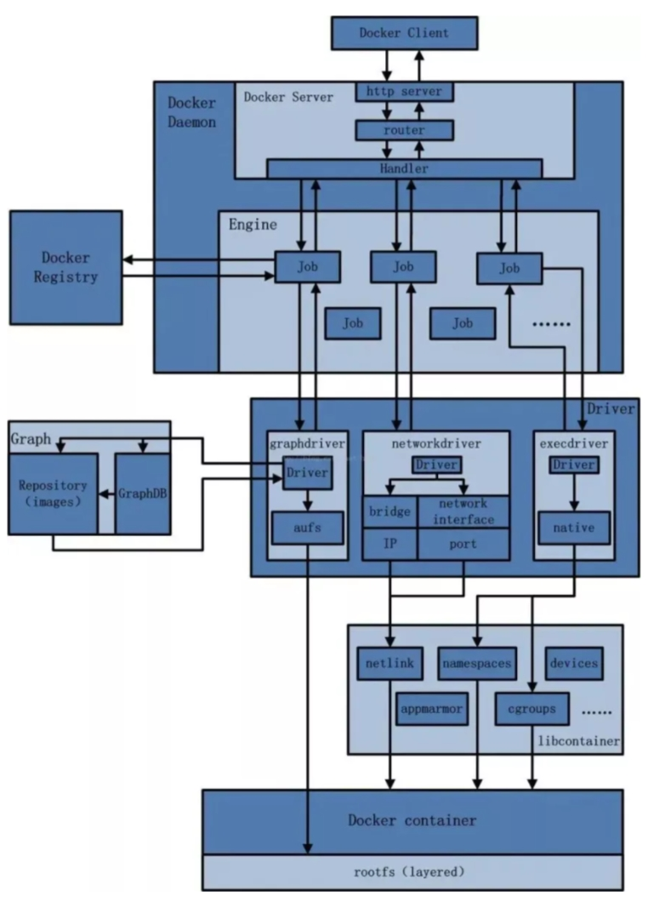

# docker

## docker 简介

**容器**： 系统平滑移植， 容器虚拟化技术

镜像就是应用：包括源码、配置环境、运行环境、运行依赖包、甚至内核等等

基于Go语言的云开源项目，“build, ship and run any app, anwhere",通过对应用组件的封装、分发、部署、运行等生命周期的管理，使用户的APP及运行环境做到“一次镜像，处处运行"

虚拟机缺点： 启动慢，资源占用多，冗余步骤多

linux 容器：与系统其他部分隔离开的一系列进程，从另一个镜像运行，由该镜像提供支持进程所需的全部文件，包含应用的所有依赖项。

容器中进程直接运行于宿主的内核，没有硬件虚拟

## docker 安装

docker并非一个通用的容器工具，依赖于正在运行的linux内核环境，其他系统想要使用，需要部署一个虚拟的linux环境

[docker官网](https://www.docker.com/)

[docker hub](https://hub.docker.com)

### docker基本组成

- 镜像（image)
  类似类模板，类的定义，一个只读的模板，可以用于创建多个容器
- 容器(container)
  类似**根据类模板实例化**，容器时用镜像创建的运行实例，每个容器相互隔离，保证安全。可以视为简易版linux环境和运行在其中的应用程序。
- 仓库(repository)
  存放镜像文件的场所，docker hub,国内的公开仓库，阿里云和网易云等等

docker 是一个Client-Server结构的系统，守护进程运行在主机上，通过Socker连接从客户端访问，守护进程从客户端接受命令并管理运行在主机上的容器。后端是一个松耦合的架构，众多模块各司其职。

基本架构：

运行流程如下：

1.用户使用Docker Client与 Docker Daemon建立通信，并发送请求给后者。

2.Docker Daemon作为Docker架构主体部分，首先提供Docker Server的功能使其可以接受Docker Client的请求。

3.Docker Engine 执行Docker 内部的一系列工作，每一项工作以job行书存在；

4.job运行过程中，当需要容器镜像时，从Docker Registry中下载镜像，并通过奖项管理驱动Graph driver 将下载的镜像以Graph的形式存储

5.当需要为Docker创建网络环境时，通过网络管理驱动Network driver创建并配置Docker容器网络环境。

6.当需要限制Docker容器运行资源或执行用户指令等操作，通过Exec driver完成。

7.Libcontainer是一项独立的容器管理包，Network driver及Exec driver都是通过Libcontainer实现对容器的操作。

#### 安装

- 首先卸载旧版本

  ```
  bash
  sudo apt-get remove docker docker-engine docker.io containerd runc
  ```
- 安装

  ```
  bash
  # 更新
  sudo apt update
  # 安装依赖项
  sudo apt install apt-transport-https ca-certificates curl gnupg2 software-properties-common
  # 配置密钥（使用阿里云)
  curl -fsSL https://mirrors.aliyun.com/docker-ce/linux/ubuntu/gpg | sudo apt-key add -
  # 添加软件源
  sudo add-apt-repository \
      "deb [arch=amd64] https://mirrors.aliyun.com/docker-ce/linux/ubuntu \
      $(lsb_release -cs) \
      stable"
  # 更新
  sudo apt-get update
  # 安装最新版
  sudo apt-get install docker-ce docker-ce-cli containerd.io docker-buildx-plugin docker-compose-plugin
  # 安装指定版本
  # 显示支持的版本
  apt-cache madison docker-ce | awk '{ print $3 }'
  # 选择所需版本安装
  VERSION_STRING=5:24.0.0-1~ubuntu.22.04~jammy
  sudo apt-get install docker-ce=$VERSION_STRING docker-ce-cli=$VERSION_STRING containerd.io docker-buildx-plugin docker-compose-plugin
  # 验证 使用docker命令必须加sudo,不然没有该命令
   sudo docker run hello-world

  ```
- 镜像加速
