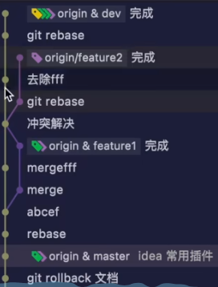

# git && github记录

使用记录

## git

### 相关指令

```bash
# 下载仓库内容
git clone **url**
git clone -b branch_name url

# 将本地内容上传到github

# 将项目重命名
git remote add origin https://github.com/rookie0109/CS_Study.git

git add .  # 将项目所有文件加到缓存区
git reset  # 撤销add内容

git commit -m '注释'

git push -u origin main


git reset # 撤销git add 操作

```

### git remote

```bash
git remote：列出当前仓库中已配置的远程仓库。
git remote -v：列出当前仓库中已配置的远程仓库，并显示它们的 URL。
git remote add <remote_name> <remote_url>：添加一个新的远程仓库。指定一个远程仓库的名称和 URL，将其添加到当前仓库中。
git remote rename <old_name> <new_name>：将已配置的远程仓库重命名。
git remote remove <remote_name>：从当前仓库中删除指定的远程仓库。
git remote set-url <remote_name> <new_url>：修改指定远程仓库的 URL。
git remote show <remote_name>：显示指定远程仓库的详细信息，包括 URL 和跟踪分支。
```

### 保存密码

```bash
# 在.git/config文件中加入
[credential]
    helper = store
```

### 推送

```bahs
git push <远程主机名> <本地分支名> <远程分支名> 
```

### 将远程仓库内容合并到本地

```bash
git pull <远程仓库名> <branch-name>
```

### 切换分支

```bash
# 查看所有分支
git branch
# 新建分支
git branch branchname
# 切换分支
git checkout <branch-name>
# 新建并切换
git checkout -b branchname
git branch branchname && git checkout branchname

# 第一次提交分支
git push -u orign <local_branch_name>
```

### 将其他分支合并到本分支

```bash
# 将<branch-name>合并到当前分支
git merge <branch-name>
```

## github

### 新建仓库

- gitignore文件

放在根目录下，可以在其中选择在git 提交过程中忽略一些文件

常见语法:

在根目录中文件内直接加入对应文件夹或者文件即可。

- 许可证

开源项目必备，其中MIT最为宽松，几乎没有限制，GPL较为严格。

### 删除仓库

`Settings`最下方'delet'

### ssh 配置

```shell

# 查看是否配置本电脑相关用户名
git config --list

# 没有配置，需要先配置
git config --global user.name "Your Name"
git config --global user.email "email@example.com"
git config --global user.password "123"  # 没有用！！！！

# 同时，为了方便重复输入相关设置，可以使用credential.helper将相关内容存储  
git config --global credential.helper store

# 生成本机密钥， 一般而言ed25519比较安全，其余还有rsa等，-t 指定生成密钥算法  -C 标识使用人邮箱
ssh-keygen -t ed25519 -C "your-email@example.com"

# 在生成密钥时，可以指定密钥文件的位置，同时需要连续两次输入设置的密码
# 检测是否配置成功，此步需要输入密码
ssh -T git@github.git

```

---


之后将.ssh/目录下的,pub文件内容，粘贴到github上相关配置界面上，

需要清楚git rebase 与 git stash  git diff的概念

 git stash :
 使用情况：临时切换分支
 ```bash
 git stash
 git checkout xx
 git checkout xx
 git stash pop
 ```

git pull = git fetch and git merge
git pull --rebase = git fetch and git rebasegit

git merge 与 git rebase 的区别
假设主分支为dev,个人在新分支feature上进行开发时,其他同事在ferture2上进行开发，并已经推送到dev分支,
核心区别是git merge 适用于主分支dev，git rebase适用于个人分支feature
```bash
git checkout dev
git merge feature1  # 非线性， feature 与 dev形成环


git checkout feature 
git rebase dev  # 解决冲突等
git checkout dev
git merge feature1  # 形成线性历史， 提交历史中feature分出一个单独的树杈

```


git rebase的使用场景之一为合并多个小分支，适用于个人，三个小commit表示的是一个功能，使用git rebase 可以将其合并成一个commit

